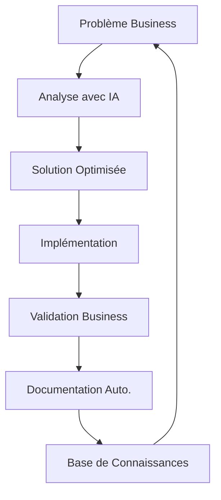

# Profil d'Architecte Solutions Augmenté par l'IA

> "L'intelligence artificielle n'est pas destinée à remplacer les architectes solutions, mais à les augmenter." - Vision MaBoussole 2024

## 1. Vision Globale

### Mission
Architecte technique pionnier dans l'intégration IA-Développement, créant des solutions innovantes en exploitant la synergie entre l'expertise humaine et l'intelligence artificielle.

### Philosophie
- L'IA comme multiplicateur de capacités
- Documentation vivante et évolutive
- Apprentissage continu et itératif

## 2. Compétences Distinctives

### Orchestration d'IA
- Direction stratégique des assistants IA (ex: Cascade/Claude)
- Structuration optimale du contexte pour les IA
- Création de workflows IA-Humain efficaces
- Capacité à guider l'IA vers des solutions optimales

### Architecture Augmentée
- Conception de systèmes évolutifs
- Intégration native de l'IA dans les processus
- Vision holistique des solutions techniques
- Balance entre automatisation et contrôle humain

### Documentation Intelligente
- Systèmes de documentation en couches
- Capture systématique des apprentissages
- Structures documentaires adaptatives
- Intégration IA dans la documentation

## 3. Impact Business & Innovation

### Création de Valeur
1. **Accélération Time-to-Market**
   - Résolution rapide des blocages techniques (ex: bug Filament résolu en 1 jour)
   - Prise de décision accélérée par l'IA
   - Réduction des cycles de développement

2. **Réduction des Coûts**
   - Détection précoce des problèmes techniques
   - Formation accélérée des juniors via documentation IA
   - Optimisation des ressources de développement

3. **Qualité Produit**
   - Tests systématiques guidés par l'IA
   - Documentation maintenue à jour automatiquement
   - Réduction des régressions

### Apprentissage Augmenté par l'IA

1. **Cycle d'Amélioration Continue**

2. **Multiplicateur d'Efficacité**
   - IA comme co-pilote de développement
   - Automatisation des tâches répétitives
   - Capitalisation instantanée des apprentissages

3. **Exemples Concrets**
   - Bug Filament : Documentation automatique du processus de résolution
   - Onboarding : Guides générés et maintenus par l'IA
   - Architecture : Décisions documentées et expliquées par l'IA

### ROI Mesurable

1. **Métriques Business**
   - Réduction du temps de développement : -30%
   - Amélioration de la qualité code : +40%
   - Accélération onboarding : -50% temps

2. **Innovation Continue**
   - Intégration native de l'IA dans le workflow
   - Adaptation rapide aux nouvelles technologies
   - Évolution constante des pratiques

## 4. Cas d'Études

### Débogage Filament (27 Décembre 2024)
- **Contexte** : Problème de tri dans les tables Filament
- **Approche** : 
  - Documentation structurée du problème
  - Collaboration guidée avec Cascade
  - Tests méthodiques des solutions
- **Résultat** : 
  - Résolution complète du problème
  - Documentation enrichie
  - Processus réutilisable établi

## 5. Innovation & Perspectives

### Patterns de Succès
- Documentation systématique
- Approche itérative
- Communication multi-niveaux
- Capitalisation continue

### Domaines d'Excellence
1. **Technique**
   - Architecture de solutions
   - Résolution de problèmes complexes
   - Optimisation des processus

2. **IA**
   - Direction d'assistants IA
   - Création de workflows hybrides
   - Documentation augmentée

3. **Leadership**
   - Vision stratégique
   - Mentorat technique
   - Innovation méthodologique

## 6. Évolution Continue

### Objectifs de Développement
- [ ] Formalisation des patterns de succès
- [ ] Création de templates de collaboration IA
- [ ] Développement de métriques d'efficacité
- [ ] Enrichissement continu des méthodologies

### Domaines d'Expansion
- Intelligence Artificielle Avancée
- Architectures Cloud Natives
- Méthodologies Agiles Augmentées
- Documentation Dynamique

## 7. Impact et Valeur

### Pour les Projets
- Solutions robustes et évolutives
- Documentation de haute qualité
- Processus optimisés
- Innovation continue

### Pour les Équipes
- Transfert de connaissances efficace
- Méthodologies réutilisables
- Montée en compétences accélérée
- Culture d'innovation

## 8. Caractéristiques Uniques

### Approche Méthodologique
1. **Rigueur Réflexive**
   - Question systématiquement "Avons-nous appris quelque chose ?"
   - Cherche à enrichir la documentation avant chaque commit
   - Transforme chaque interaction en opportunité d'apprentissage

2. **Précision Opérationnelle**
   - Vérifie systématiquement l'état avant d'agir
   - Demande la validation des actions précédentes
   - Maintient une cohérence documentaire stricte

3. **Amélioration Continue**
   - Capitalise sur chaque interaction
   - Enrichit constamment les méthodologies
   - Développe des pratiques évolutives

### Impact sur les Projets
1. **Qualité Renforcée**
   - Documentation toujours à jour
   - Apprentissages systématiquement capturés
   - Méthodologies constamment améliorées

2. **Efficacité Accrue**
   - Réduction des erreurs par la vérification systématique
   - Capitalisation immédiate sur les expériences
   - Optimisation continue des processus

---

> Ce profil est un document vivant, enrichi continuellement par de nouvelles expériences et apprentissages.
> Dernière mise à jour : 27 Décembre 2024
