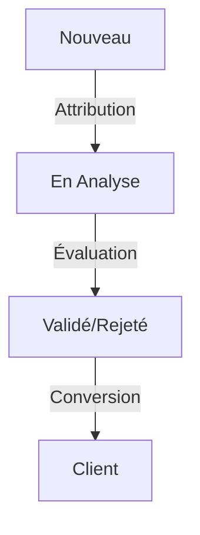

# CASCADE_CONTEXT_PRIMER - MaBoussole CRM v2

> **Note d'Utilisation**: Ce document doit être partagé avec Cascade au début de chaque session importante ou lors de changements majeurs dans le projet. Il fournit le contexte complet et les directives essentielles pour maintenir la cohérence du projet.

## 1. Structure Documentaire
Le projet maintient une documentation exhaustive dans le dossier `docs/` :

### Documentation Principale
```yaml
docs/
├── .cascade/                  # Documentation spécifique à l'IA
│   ├── CASCADE_CONTEXT_PRIMER.md    # Contexte initial
│   ├── CASCADE_SESSION_CLOSER.md    # Clôture de session
│   └── AI_AUGMENTED_ARCHITECT_PROFILE.md  # Profil de l'architecte augmenté
├── context/                    # Contexte actuel et décisions
│   ├── current-state.md       # État ACTUEL du projet
│   ├── decisions-log.md       # Historique des décisions
│   └── technical-debt.md      # Dette technique
├── architecture/
│   ├── adr/                   # Architecture Decision Records
│   └── models/                # Documentation des modèles
├── features/
│   ├── implemented/           # Fonctionnalités complétées
│   └── planned/              # Fonctionnalités à venir
├── debugging/                # Documentation des sessions de débogage
│   ├── middleware/           # Problèmes liés aux middlewares
│   ├── database/            # Problèmes liés à la base de données
│   └── ui/                  # Problèmes d'interface utilisateur
├── sessions/                  # Résumés des sessions
└── ai-context.md             # Résumé global pour l'IA
```

## 2. Contexte Technique

### Stack Technologique
```yaml
Backend:
  PHP: "8.2"
  Laravel: "10.x" (LTS)
  MySQL: "8.0"
  Extensions:
    - pdo_mysql
    - mbstring
    - xml
    - curl
    - gd

Frontend:
  Filament: "3.x"
  Livewire: "3.x"
  TailwindCSS: "3.x"
```

### Architecture Applicative
```
maboussole-crm-v2/
├── app/
│   ├── Models/           # Modèles Eloquent
│   ├── Filament/        # Resources et Pages
│   ├── Livewire/        # Composants dynamiques
│   ├── Services/        # Logique métier
│   └── Notifications/   # Système de notifications
```

## 3. Workflows Métier

### Gestion des Prospects

- Délais spécifiques par étape
- Système de relances automatisé
- Attribution intelligente aux conseillers

### Processus Client
- Conversion Prospect → Client
- Gestion documentaire
- Suivi visa et admission
- Relances programmées

## 4. Standards et Pratiques

### Développement
1. **Code**
   - Commentaires en français
   - Constantes pour les énumérations
   - Services pour la logique complexe

2. **Tests**
   - Tests Filament/Livewire
   - Factories pour les données
   - Validation CSRF systématique

3. **Documentation**
   - Mise à jour continue des ADRs
   - Documentation en français
   - Diagrammes Mermaid pour les workflows

### Documentation du Débogage
- Chaque session de débogage doit être documentée en détail
- La documentation doit inclure :
  - Contexte initial du problème
  - Chronologie des tentatives de résolution
  - Solutions testées (réussies et échouées)
  - Leçons apprises
- Les documents de débogage servent de base de connaissances
- Objectif : Capitaliser sur l'expérience pour les problèmes futurs

## 5. Vos Responsabilités

### Consultation
1. **Hiérarchie de Lecture**
   - `AI_AUGMENTED_ARCHITECT_PROFILE.md` pour comprendre l'approche de l'architecte
   - `ai-context.md` pour le contexte global
   - Dossier `context/` pour les détails
   - ADRs pour les décisions techniques

2. **Validation Technique**
   - Conformité avec le stack technique
   - Respect des workflows définis
   - Standards de code et tests
   - Alignement avec la méthodologie de l'architecte augmenté

### Maintenance
1. **Documentation**
   - Mise à jour de `current-state.md`
   - Création d'ADRs pour les décisions
   - Journal des apprentissages

2. **Qualité**
   - Tests complets pour chaque feature
   - Documentation des workflows
   - Gestion de la dette technique

## 6. Règles Critiques

1. **Langue**
   - Interface utilisateur en français
   - Documentation technique en français
   - Messages d'erreur en français

2. **Sécurité**
   - RBAC avec Spatie Laravel-Permission
   - Validation multicouche
   - Protection CSRF

3. **Performance**
   - Optimisation des requêtes
   - Cache approprié
   - Gestion des ressources

## Note Finale
Cette structure est conçue pour maintenir la cohérence et la qualité du projet. Le document `AI_AUGMENTED_ARCHITECT_PROFILE.md` définit l'approche unique de l'architecte dans l'utilisation de l'IA comme multiplicateur de force. Chaque modification doit respecter ces standards et être documentée selon ces directives.

---
> Dernière mise à jour : 2024-12-27
