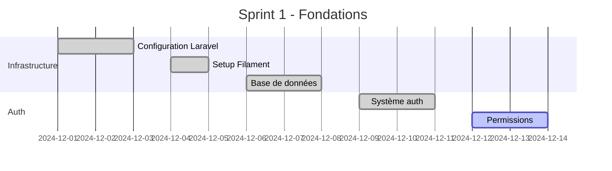
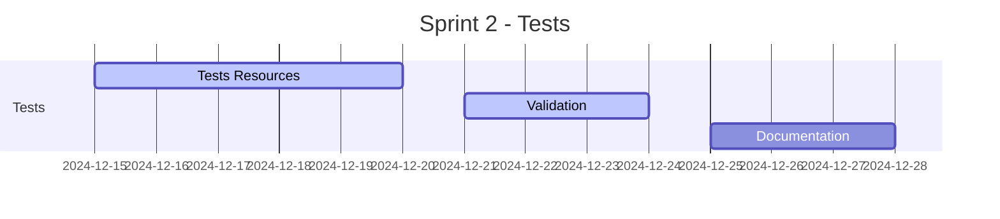

# Roadmap - MaBoussole CRM v2

> Dernière mise à jour : 2024-12-21

## Vue d'ensemble
Planning détaillé du développement de MaBoussole CRM v2, organisé en sprints de 2 semaines.

## Planning des Sprints

### Sprint 1 : Fondations (1-14 Décembre 2024)

#### Status : ✅ Complété
- [x] Configuration initiale
- [x] Mise en place de l'authentification
- [x] Configuration de Filament
- [x] Structure de base de données

### Sprint 2 : Tests et Optimisation (15-28 Décembre 2024)

#### Status : 🔄 En cours
- [x] Tests ClientResource
- [ ] Tests ActivityResource
- [ ] Documentation technique

### Sprint 3 : Gestion Prospects (29 Décembre - 11 Janvier 2025)
#### Planifié
- [ ] Module de prospects
- [ ] Système d'attribution
- [ ] Workflow d'analyse

### Sprint 4 : Documents (12-25 Janvier 2025)
#### Planifié
- [ ] Gestion documents
- [ ] Validation automatique
- [ ] Notifications

### Sprint 5 : Clients (26 Janvier - 8 Février 2025)
#### Planifié
- [ ] Conversion prospects
- [ ] Suivi client
- [ ] Tableau de bord

## Métriques et KPIs

### Progression Globale
- **Sprints Complétés** : 1/5
- **Points Réalisés** : 34/150
- **Vélocité Moyenne** : 17 points/sprint

### Qualité Code
- **Couverture Tests** : 94%
- **Bugs Critiques** : 0
- **Dette Technique** : Faible

## Risques et Mitigations

### 1. Délais [MEDIUM]
- **Impact** : Retard livraison
- **Mitigation** : Buffer 20% par sprint

### 2. Technique [LOW]
- **Impact** : Performance
- **Mitigation** : Tests charge réguliers

### 3. Adoption [LOW]
- **Impact** : ROI
- **Mitigation** : Formation continue

## Prochaines Étapes

### Court Terme (Sprint 2)
1. Finaliser tests Resources
2. Documenter architecture
3. Préparer Sprint 3

### Moyen Terme (Q1 2025)
1. Module prospects complet
2. Système documents
3. Conversion clients

### Long Terme (Q2 2025)
1. Analytics avancés
2. Intégrations tierces
3. Mobile app

---
*Documentation générée pour MaBoussole CRM v2*
