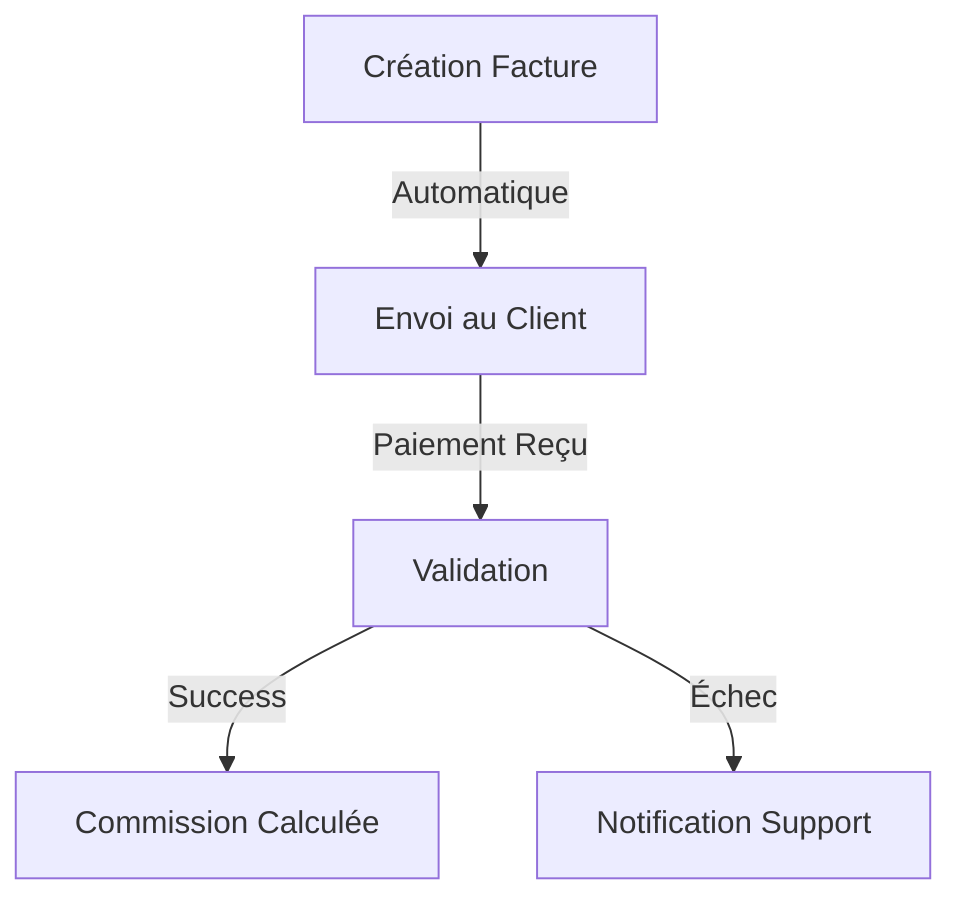
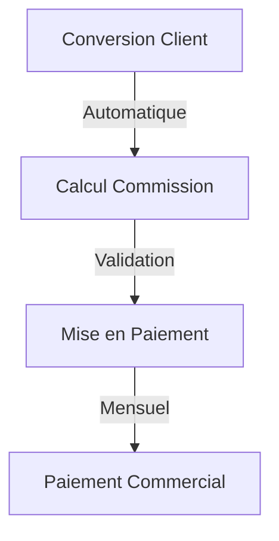

# Spécifications Additionnelles - MaBoussole CRM v2

## 1. Schéma de Base de Données Additionnel

### Nouvelles Tables

```sql
-- Paiements
payments
├── id (bigint, primary key)
├── client_id (bigint, foreign key)
├── amount (decimal)
├── currency (varchar)
├── payment_method (enum)
├── status (enum)
├── transaction_id (varchar)
├── payment_date (timestamp)
└── timestamps

-- Commissions
commissions
├── id (bigint, primary key)
├── commercial_id (bigint, foreign key)
├── prospect_id (bigint, foreign key)
├── amount (decimal)
├── status (enum)
├── paid_at (timestamp)
└── timestamps

-- Paramètres Système
settings
├── id (bigint, primary key)
├── key (varchar)
├── value (json)
├── group (varchar)
└── timestamps
```

### Nouveaux Index
```sql
-- Performance Indexes
CREATE INDEX idx_payments_date ON payments(payment_date);
CREATE INDEX idx_commissions_commercial ON commissions(commercial_id, status);
CREATE INDEX idx_prospects_dates ON prospects(created_at, analysis_deadline);
```

### Contraintes de Validation
```sql
-- Montants positifs
ALTER TABLE payments ADD CONSTRAINT positive_amount 
    CHECK (amount > 0);

-- Dates cohérentes
ALTER TABLE prospects ADD CONSTRAINT valid_deadline 
    CHECK (analysis_deadline > created_at);
```

## 2. Workflows Additionnels

### Workflow de Paiement


### Workflow des Commissions


### SLA par Étape
```yaml
Analyse Prospect:
  délai_max: 5 jours ouvrés
  alertes:
    - J+3: Email manager
    - J+4: SMS manager
    - J+5: Escalade direction

Validation Document:
  délai_max: 48 heures
  alertes:
    - H+24: Email conseiller
    - H+36: Email manager

Traitement Paiement:
  délai_max: 24 heures
  alertes:
    - H+12: Email comptabilité
    - H+18: SMS comptabilité
```

## 3. Permissions Additionnelles

### Permissions Financières
```php
[
    'payments.view',
    'payments.create',
    'payments.refund',
    'commissions.calculate',
    'commissions.validate',
    'commissions.pay'
]
```

### Permissions Temporaires
```php
class TemporaryPermission extends Model
{
    protected $fillable = [
        'user_id',
        'permission',
        'granted_by',
        'expires_at'
    ];

    public function isValid()
    {
        return $this->expires_at > now();
    }
}
```

## 4. Notifications Additionnelles

### Templates Multilingues
```php
class NotificationTemplate
{
    protected $templates = [
        'payment.success' => [
            'fr' => [
                'subject' => 'Paiement reçu',
                'body' => 'Votre paiement de {amount} € a été reçu.'
            ],
            'en' => [
                'subject' => 'Payment received',
                'body' => 'Your payment of €{amount} has been received.'
            ]
        ]
    ];

    public function getTemplate($key, $lang = 'fr')
    {
        return $this->templates[$key][$lang] ?? null;
    }
}
```

### Stratégie de Retry
```php
class NotificationRetryStrategy
{
    protected $maxAttempts = 5;
    protected $delays = [
        1 => 300,    // 5 minutes
        2 => 900,    // 15 minutes
        3 => 3600,   // 1 heure
        4 => 86400   // 24 heures
    ];

    public function shouldRetry($attempt, $error)
    {
        if ($attempt >= $this->maxAttempts) return false;
        if ($this->isPermamentError($error)) return false;
        return true;
    }
}
```

## 5. Planning Agile Additionnel

### Sprint 11-12 : Tests et Performance
```agile
Stories:
1. Tests de Charge [13 points]
   - Simulation 1000 utilisateurs
   - Monitoring performance
   - Optimisation requêtes

2. Tests de Sécurité [8 points]
   - Audit sécurité
   - Tests pénétration
   - Correction vulnérabilités
```

### Plan de Formation
```yaml
Formations:
  - Introduction:
      durée: 2h
      public: Tous les utilisateurs
      contenu:
        - Navigation interface
        - Fonctionnalités de base
        - Sécurité

  - Administration:
      durée: 4h
      public: Managers et Admins
      contenu:
        - Gestion utilisateurs
        - Configuration système
        - Rapports avancés

  - Opérationnel:
      durée: 3h
      public: Conseillers
      contenu:
        - Gestion prospects
        - Suivi clients
        - Workflow documents
```

### Stratégie de Déploiement
```yaml
Phases:
  1. Préparation:
     - Backup données
     - Tests finaux
     - Formation équipe

  2. Déploiement:
     - Migration base
     - Déploiement app
     - Tests smoke

  3. Post-déploiement:
     - Monitoring 24/7
     - Support dédié
     - Collecte feedback
```

## 6. Métriques de Performance

### KPIs Techniques
```yaml
Performance:
  - Temps réponse API: < 200ms
  - Temps chargement page: < 2s
  - Utilisation CPU: < 70%
  - Utilisation RAM: < 80%

Disponibilité:
  - Uptime: 99.9%
  - Temps backup: < 30min
  - RTO: < 2h
  - RPO: < 15min
```

### KPIs Métier
```yaml
Conversion:
  - Taux analyse prospects: > 95%
  - Délai moyen analyse: < 3 jours
  - Taux conversion: > 25%

Satisfaction:
  - NPS: > 50
  - Support response time: < 4h
  - Taux résolution: > 90%
```
