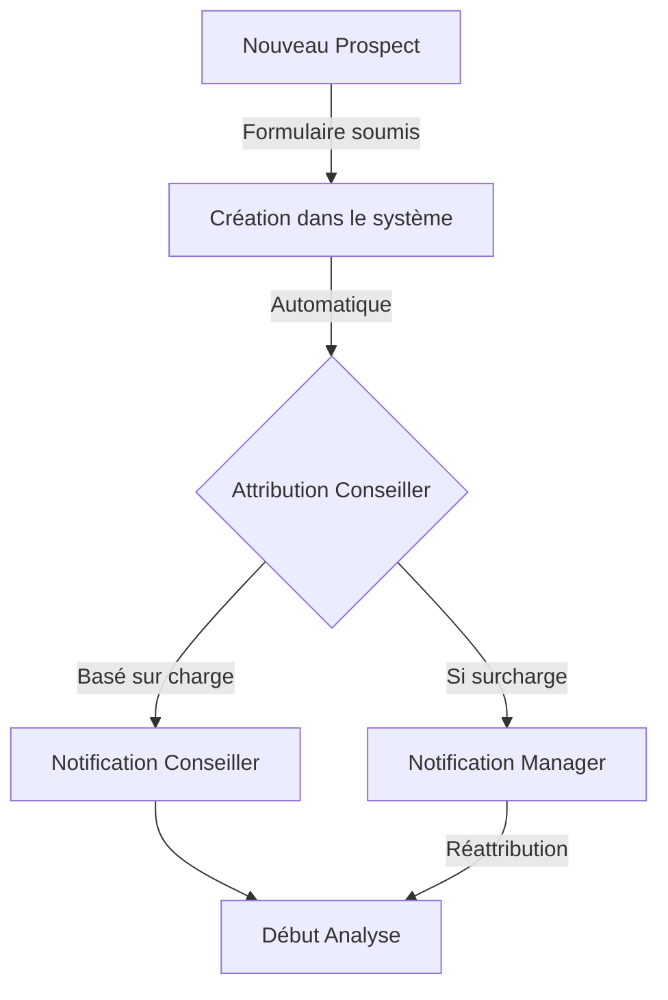
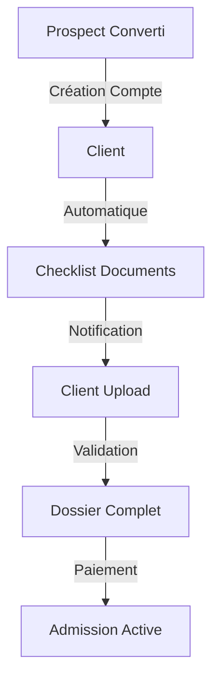
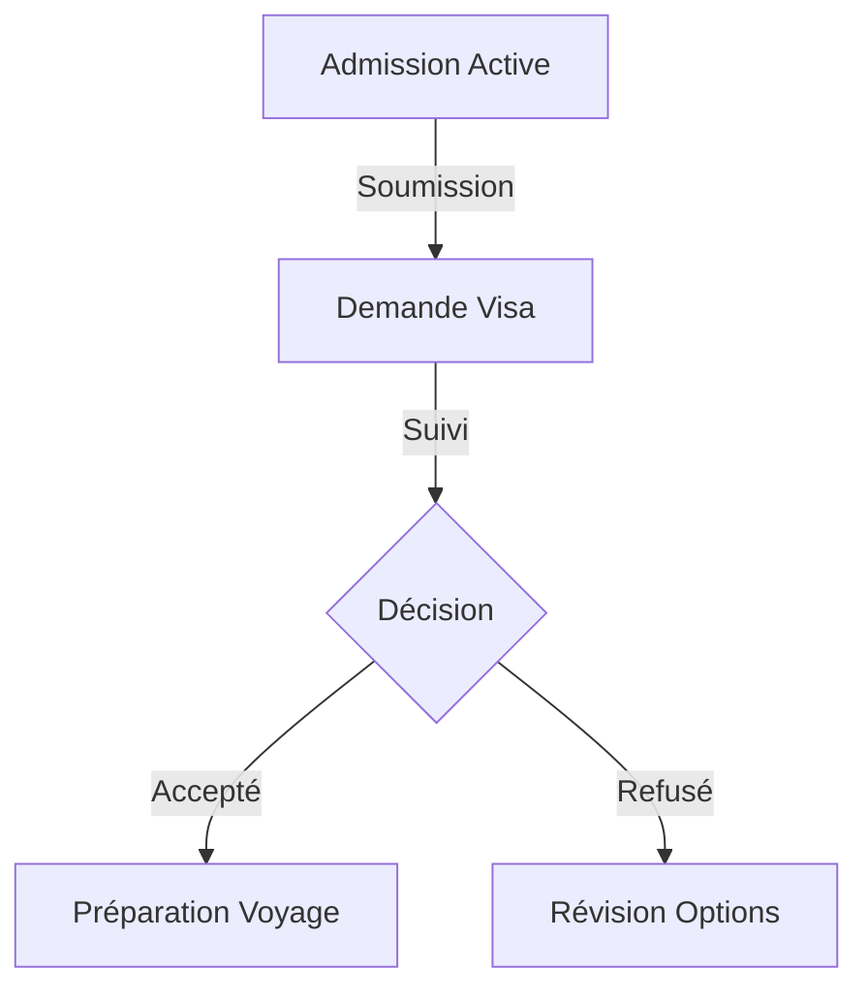
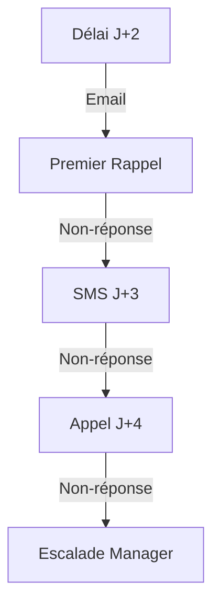
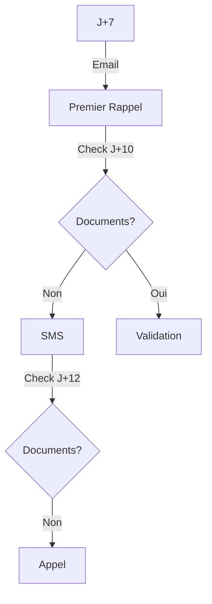

# Workflows Détaillés - MaBoussole CRM v2

## 1. Workflow de Gestion des Prospects

### Phase 1: Création et Attribution

### États du Prospect
1. **Nouveau**
   - Délai: Immédiat
   - Actions: 
     - Création fiche prospect
     - Attribution conseiller
     - Envoi notifications

2. **En Analyse**
   - Délai: 0-5 jours
   - Actions:
     - Vérification documents
     - Évaluation éligibilité
     - Relances si nécessaire

3. **Validé/Rejeté**
   - Délai: Jour 5 max
   - Actions:
     - Rapport d'analyse
     - Notification prospect
     - Archivage si rejeté

4. **Converti**
   - Actions:
     - Création compte client
     - Migration données
     - Initialisation processus admission

## 2. Workflow d'Admission Client

### Phase 1: Initialisation

### Phase 2: Visa

### États du Client
1. **Initial**
   - Actions:
     - Création checklist
     - Configuration notifications
     - Planning initial

2. **Documents**
   - Délai: 2 semaines
   - Relances:
     - J+7: Email
     - J+10: SMS
     - J+12: Appel

3. **Visa**
   - Suivi:
     - Soumission
     - Tracking
     - Résultat

4. **Voyage**
   - Options:
     - Accueil
     - Logement
     - Insertion

## 3. Système de Relances

### Relances Prospects

### Relances Documents

## 4. Workflow de Validation Documents

### Process
1. **Soumission**
   - Upload sécurisé
   - Scan antivirus
   - Vérification format

2. **Validation**
   - Contrôle qualité
   - Vérification données
   - Validation conseiller

3. **Archivage**
   - Classification
   - Indexation
   - Stockage sécurisé

## 5. Workflow de Paiement

### États
1. **En attente**
   - Facture générée
   - Notification client

2. **Partiel**
   - Suivi échéancier
   - Relances automatiques

3. **Complété**
   - Confirmation
   - Déblocage services

## 6. Automatisations

### Notifications
- **Email**: Changements statut, rappels, validations
- **SMS**: Urgences, confirmations
- **In-App**: Temps réel, actions requises

### Tâches
- Attribution prospects
- Génération rapports
- Archivage documents
- Relances automatiques

### Métriques
- Temps traitement
- Taux conversion
- Performance conseillers
- Satisfaction clients
