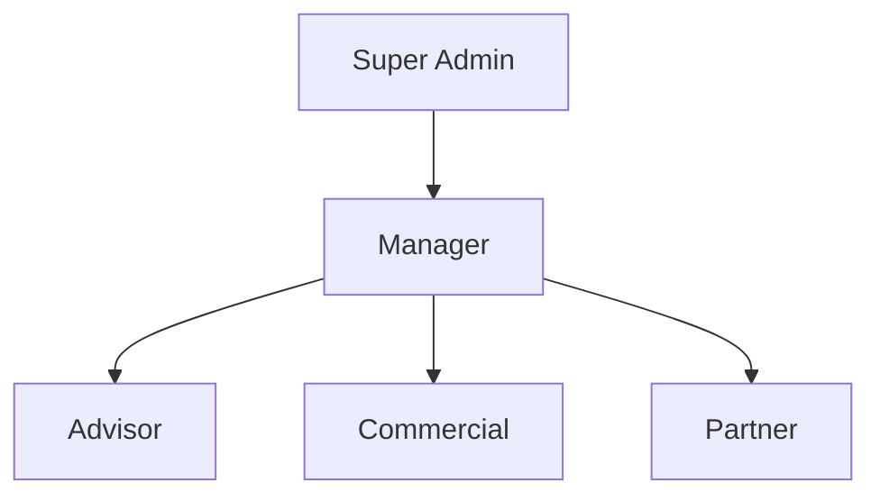

# Authentification et Permissions - MaBoussole CRM v2

> Dernière mise à jour : 2024-12-21

## Vue d'ensemble
Documentation du système d'authentification et de gestion des permissions de MaBoussole CRM v2.

## Système de Rôles

### Rôles Disponibles
```php
const ROLES = [
    'super_admin'  => 'Super Administrateur',
    'manager'      => 'Manager',
    'advisor'      => 'Conseiller',
    'partner'      => 'Partenaire',
    'commercial'   => 'Commercial'
];
```

### Hiérarchie des Rôles


## Permissions

### Gestion des Prospects
```php
[
    'prospects.view',
    'prospects.create',
    'prospects.edit',
    'prospects.delete',
    'prospects.assign',
    'prospects.convert'
]
```

### Gestion des Clients
```php
[
    'clients.view',
    'clients.create',
    'clients.edit',
    'clients.delete',
    'clients.manage_documents',
    'clients.process_payments'
]
```

### Attribution des Permissions par Rôle

#### Super Admin
```php
// Accès complet
'*'
```

#### Manager
```php
[
    'prospects.*',
    'clients.*',
    'users.view',
    'users.create',
    'users.edit',
    'reports.view',
    'reports.export'
]
```

#### Advisor
```php
[
    'prospects.view',
    'prospects.edit',
    'clients.view',
    'clients.edit',
    'activities.manage'
]
```

## Middleware de Sécurité

### Vérification des Rôles
```php
// Routes/web.php
Route::middleware(['role:manager|admin'])->group(function () {
    Route::get('/dashboard', 'DashboardController@index');
});
```

### Vérification des Permissions
```php
// Dans les contrôleurs
public function update(Request $request, Client $client)
{
    $this->authorize('edit', $client);
    // ...
}
```

## Authentification

### Configuration
```php
// config/auth.php
'guards' => [
    'web' => [
        'driver' => 'session',
        'provider' => 'users',
    ],
    'api' => [
        'driver' => 'sanctum',
        'provider' => 'users',
    ],
],
```

### Processus de Login
```php
public function login(Request $request)
{
    $credentials = $request->validate([
        'email' => 'required|email',
        'password' => 'required',
    ]);

    if (Auth::attempt($credentials)) {
        $request->session()->regenerate();
        return redirect()->intended('dashboard');
    }
}
```

## Policies

### ClientPolicy
```php
class ClientPolicy
{
    public function view(User $user, Client $client)
    {
        return $user->hasRole('manager') || 
               $user->id === $client->advisor_id;
    }

    public function update(User $user, Client $client)
    {
        return $user->hasPermissionTo('clients.edit') && 
               ($user->hasRole('manager') || 
                $user->id === $client->advisor_id);
    }
}
```

## Sécurité

### Protection CSRF
```php
// Middleware
\App\Http\Middleware\VerifyCsrfToken::class
```

### Rate Limiting
```php
// Routes/web.php
Route::middleware(['throttle:login'])->group(function () {
    Route::post('/login', 'Auth\LoginController@login');
});
```

## Tests

### Test des Rôles
```php
class RoleTest extends TestCase
{
    /** @test */
    public function manager_can_view_all_clients()
    {
        $manager = User::factory()
            ->create()
            ->assignRole('manager');

        $response = $this->actingAs($manager)
            ->get('/clients');

        $response->assertSuccessful();
    }
}
```

### Test des Permissions
```php
/** @test */
public function advisor_can_only_view_assigned_clients()
{
    $advisor = User::factory()
        ->create()
        ->assignRole('advisor');

    $assignedClient = Client::factory()
        ->create(['advisor_id' => $advisor->id]);

    $otherClient = Client::factory()->create();

    $this->actingAs($advisor)
        ->get("/clients/{$assignedClient->id}")
        ->assertSuccessful();

    $this->actingAs($advisor)
        ->get("/clients/{$otherClient->id}")
        ->assertForbidden();
}
```

## Maintenance

### Commandes Utiles
```bash
# Rafraîchir les permissions
php artisan permission:cache-reset

# Créer un nouveau rôle
php artisan make:role NomDuRole

# Vérifier les permissions
php artisan permission:show
```

---
*Documentation générée pour MaBoussole CRM v2*
