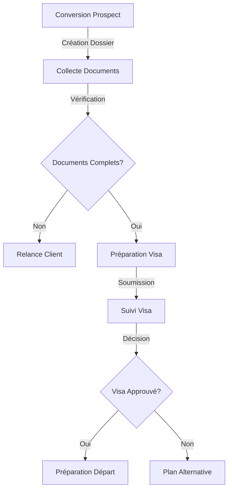
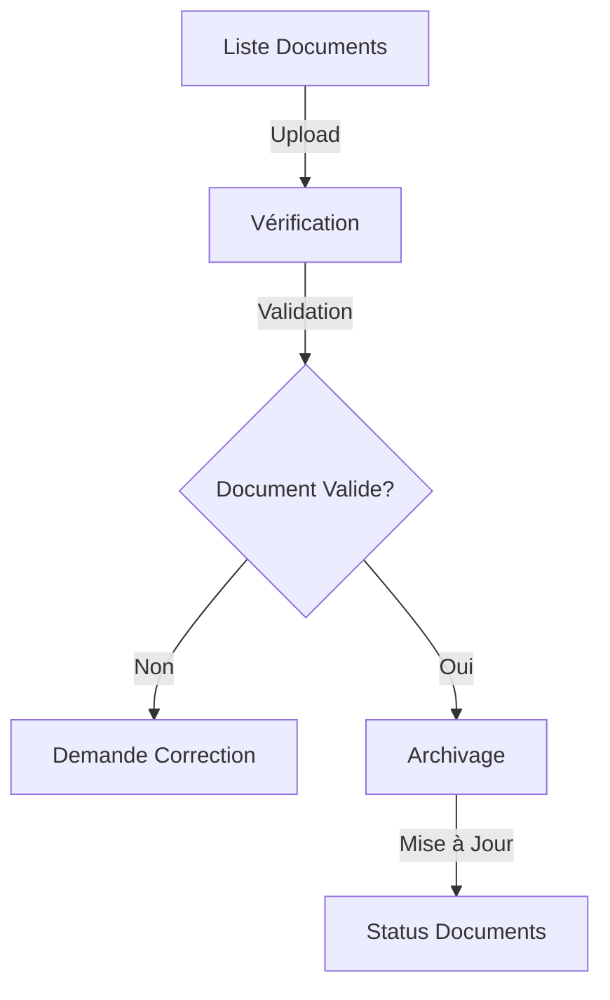

# Gestion des Clients - MaBoussole CRM v2

> Dernière mise à jour : 2024-12-21

## Vue d'ensemble
Documentation du module de gestion des clients, incluant le suivi des dossiers et la gestion des documents.

## Modèle de Données

### Structure
```php
class Client extends Model
{
    protected $fillable = [
        'prospect_id',
        'reference_number',
        'status',
        'payment_status',
        'advisor_id',
        'documents_status',
        'visa_status'
    ];

    protected $casts = [
        'documents_status' => 'array',
        'payment_details' => 'array'
    ];
}
```

### États du Client
```php
const STATUSES = [
    'active'    => 'Actif',
    'inactive'  => 'Inactif',
    'pending'   => 'En Attente',
    'archived'  => 'Archivé'
];

const PAYMENT_STATUSES = [
    'pending'   => 'En Attente',
    'partial'   => 'Partiel',
    'completed' => 'Complété'
];

const VISA_STATUSES = [
    'not_started'  => 'Non Démarré',
    'in_progress'  => 'En Cours',
    'approved'     => 'Approuvé',
    'rejected'     => 'Rejeté'
];
```

## Workflow

### 1. Suivi Client


### 2. Gestion Documents


## Interface Filament

### Resource Configuration
```php
class ClientResource extends Resource
{
    public static function form(Form $form): Form
    {
        return $form
            ->schema([
                Card::make()
                    ->schema([
                        TextInput::make('reference_number')
                            ->disabled(),
                        Select::make('status')
                            ->options(Client::STATUSES)
                            ->required(),
                        Select::make('payment_status')
                            ->options(Client::PAYMENT_STATUSES),
                        Select::make('visa_status')
                            ->options(Client::VISA_STATUSES),
                        Select::make('advisor_id')
                            ->relationship('advisor', 'name')
                            ->searchable(),
                    ]),
                Card::make()
                    ->schema([
                        FileUpload::make('documents')
                            ->multiple()
                            ->directory('client-documents'),
                        Repeater::make('documents_status')
                            ->schema([
                                TextInput::make('document_name'),
                                Select::make('status')
                                    ->options([
                                        'pending' => 'En Attente',
                                        'received' => 'Reçu',
                                        'validated' => 'Validé',
                                        'rejected' => 'Rejeté'
                                    ])
                            ])
                    ])
            ]);
    }

    public static function table(Table $table): Table
    {
        return $table
            ->columns([
                TextColumn::make('reference_number'),
                TextColumn::make('prospect.full_name'),
                BadgeColumn::make('status'),
                BadgeColumn::make('payment_status'),
                BadgeColumn::make('visa_status'),
                TextColumn::make('advisor.name'),
            ])
            ->filters([
                SelectFilter::make('status'),
                SelectFilter::make('payment_status'),
                SelectFilter::make('visa_status'),
                SelectFilter::make('advisor_id')
            ])
            ->actions([
                EditAction::make(),
                Action::make('documents')
                    ->url(fn (Client $record): string => 
                        route('filament.resources.clients.documents', $record)),
                Action::make('visa')
                    ->url(fn (Client $record): string => 
                        route('filament.resources.clients.visa', $record))
            ]);
    }
}
```

## Services

### Gestion Documents
```php
class DocumentManagementService
{
    public function uploadDocument(Client $client, UploadedFile $file): Document
    {
        $path = $file->store('client-documents');
        
        return Document::create([
            'client_id' => $client->id,
            'name' => $file->getClientOriginalName(),
            'path' => $path,
            'status' => 'pending'
        ]);
    }

    public function validateDocument(Document $document): void
    {
        $document->update(['status' => 'validated']);
        
        $this->updateClientDocumentStatus($document->client);
    }
}
```

### Suivi Visa
```php
class VisaTrackingService
{
    public function updateStatus(Client $client, string $status): void
    {
        $client->update(['visa_status' => $status]);

        if ($status === 'approved') {
            event(new VisaApprovedEvent($client));
        }
    }

    public function generateVisaDocuments(Client $client): array
    {
        // Logique de génération des documents
    }
}
```

## Notifications

### Rappels Documents
```php
class DocumentReminderNotification extends Notification
{
    public function toMail($notifiable)
    {
        return (new MailMessage)
            ->subject('Documents Manquants')
            ->line('Certains documents sont manquants dans votre dossier.')
            ->action('Voir les Documents', url('/documents'));
    }
}
```

## Tests

### Tests Unitaires
```php
class ClientTest extends TestCase
{
    /** @test */
    public function it_can_track_document_status()
    {
        $client = Client::factory()->create();
        $document = Document::factory()->create([
            'client_id' => $client->id
        ]);

        $service = new DocumentManagementService();
        $service->validateDocument($document);

        $this->assertEquals('validated', $document->fresh()->status);
    }
}
```

## Maintenance

### Commandes Artisan
```bash
# Nettoyage documents
php artisan clients:clean-documents

# Rappels automatiques
php artisan clients:send-reminders

# Statistiques
php artisan clients:generate-stats
```

---
*Documentation générée pour MaBoussole CRM v2*
