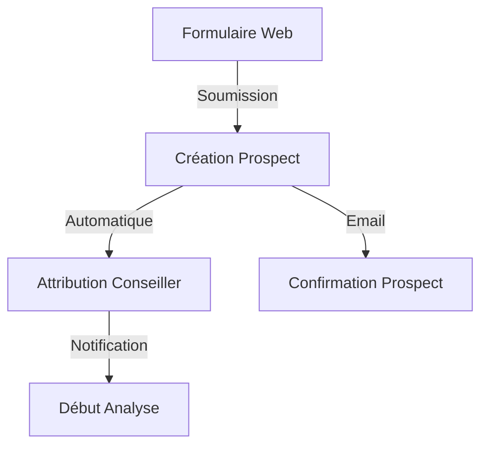
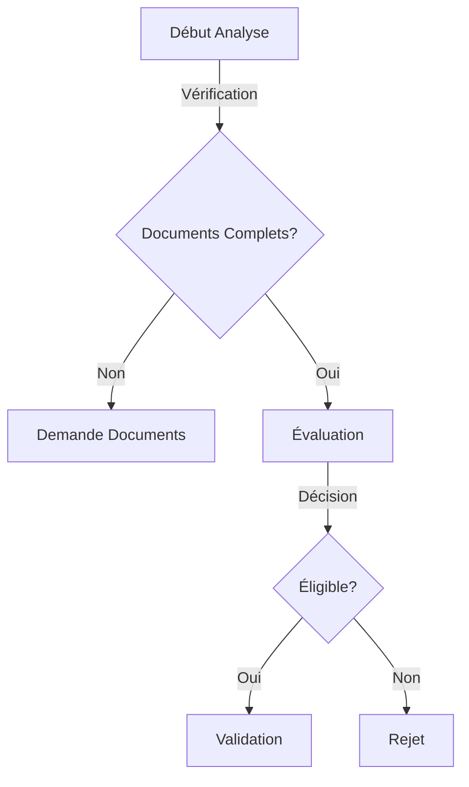

# Gestion des Prospects - MaBoussole CRM v2

> Dernière mise à jour : 2024-12-21

## Vue d'ensemble
Documentation du module de gestion des prospects, incluant le workflow d'acquisition et de qualification.

## Modèle de Données

### Structure
```php
class Prospect extends Model
{
    protected $fillable = [
        'reference_number',
        'first_name',
        'last_name',
        'email',
        'phone',
        'status',
        'advisor_id',
        'education_level',
        'desired_destination',
        'analysis_deadline'
    ];

    protected $casts = [
        'analysis_deadline' => 'datetime',
        'documents_status' => 'array'
    ];
}
```

### États du Prospect
```php
const STATUSES = [
    'new'       => 'Nouveau',
    'analyzing' => 'En Analyse',
    'validated' => 'Validé',
    'rejected'  => 'Rejeté',
    'converted' => 'Converti'
];
```

## Workflow

### 1. Création


### 2. Analyse


## Interface Filament

### Resource Configuration
```php
class ProspectResource extends Resource
{
    public static function form(Form $form): Form
    {
        return $form
            ->schema([
                Forms\Components\TextInput::make('first_name')
                    ->required(),
                Forms\Components\TextInput::make('last_name')
                    ->required(),
                Forms\Components\TextInput::make('email')
                    ->email()
                    ->required(),
                Forms\Components\Select::make('status')
                    ->options(Prospect::STATUSES)
                    ->required(),
                // ...
            ]);
    }

    public static function table(Table $table): Table
    {
        return $table
            ->columns([
                Tables\Columns\TextColumn::make('reference_number'),
                Tables\Columns\TextColumn::make('full_name'),
                Tables\Columns\BadgeColumn::make('status'),
                Tables\Columns\TextColumn::make('advisor.name'),
                Tables\Columns\TextColumn::make('created_at'),
            ])
            ->filters([
                Tables\Filters\SelectFilter::make('status'),
                Tables\Filters\SelectFilter::make('advisor'),
            ])
            ->actions([
                Tables\Actions\EditAction::make(),
                Tables\Actions\DeleteAction::make(),
                Action::make('convert')
                    ->action(fn (Prospect $record) => $this->convert($record))
                    ->requiresConfirmation(),
            ]);
    }
}
```

## Services

### Attribution Automatique
```php
class ProspectAssignmentService
{
    public function assign(Prospect $prospect): User
    {
        return User::role('advisor')
            ->withCount('prospects')
            ->orderBy('prospects_count')
            ->first();
    }
}
```

### Conversion en Client
```php
class ProspectConversionService
{
    public function convert(Prospect $prospect): Client
    {
        DB::transaction(function () use ($prospect) {
            $client = Client::create([
                'prospect_id' => $prospect->id,
                'advisor_id' => $prospect->advisor_id,
                'status' => 'active'
            ]);

            $prospect->update(['status' => 'converted']);

            return $client;
        });
    }
}
```

## Notifications

### Nouveau Prospect
```php
class NewProspectNotification extends Notification
{
    public function toMail($notifiable)
    {
        return (new MailMessage)
            ->subject('Nouveau Prospect Assigné')
            ->line("Un nouveau prospect vous a été assigné.")
            ->action('Voir le Prospect', url('/admin/prospects/'.$this->prospect->id));
    }
}
```

## Tests

### Tests Unitaires
```php
class ProspectTest extends TestCase
{
    /** @test */
    public function it_can_be_assigned_to_advisor()
    {
        $advisor = User::factory()->create()->assignRole('advisor');
        $prospect = Prospect::factory()->create();

        $service = new ProspectAssignmentService();
        $assigned = $service->assign($prospect);

        $this->assertEquals($advisor->id, $assigned->id);
    }
}
```

### Tests de Feature
```php
class ProspectResourceTest extends TestCase
{
    /** @test */
    public function it_can_convert_prospect_to_client()
    {
        $prospect = Prospect::factory()->create(['status' => 'validated']);

        $response = $this->post("/admin/prospects/{$prospect->id}/convert");

        $response->assertRedirect();
        $this->assertDatabaseHas('clients', ['prospect_id' => $prospect->id]);
    }
}
```

## Maintenance

### Commandes Artisan
```bash
# Nettoyer les prospects obsolètes
php artisan prospects:clean

# Rappels automatiques
php artisan prospects:send-reminders

# Statistiques
php artisan prospects:stats
```

---
*Documentation générée pour MaBoussole CRM v2*
