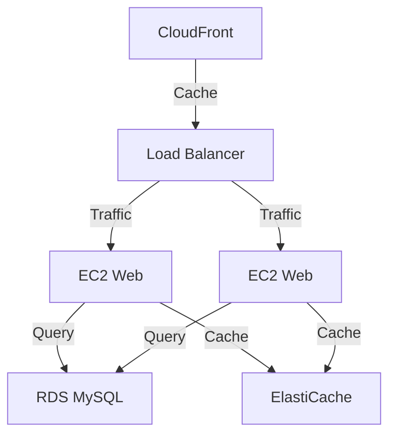

# Guide de Déploiement - MaBoussole CRM v2

> Dernière mise à jour : 2024-12-21

## Vue d'ensemble
Documentation complète du processus de déploiement de MaBoussole CRM v2.

## Environnements

### Production
```yaml
URL: https://app.maboussole.com
Server: AWS EC2 t3.large
Region: eu-west-3 (Paris)
```

### Staging
```yaml
URL: https://staging.maboussole.com
Server: AWS EC2 t3.small
Region: eu-west-3 (Paris)
```

## Infrastructure

### Architecture


### Services AWS
```yaml
Load Balancer: Application Load Balancer
Database: RDS MySQL 8.0
Cache: ElastiCache Redis
Storage: S3
CDN: CloudFront
Monitoring: CloudWatch
```

## Processus de Déploiement

### 1. Préparation
```bash
# Vérification des tests
php artisan test --env=testing

# Compilation des assets
npm run build

# Optimisation
php artisan optimize
php artisan view:cache
php artisan route:cache
php artisan config:cache
```

### 2. Déploiement
```bash
# Connexion au serveur
ssh deploy@maboussole.com

# Pull des changements
cd /var/www/maboussole
git pull origin main

# Installation des dépendances
composer install --no-dev --optimize-autoloader
npm ci --production

# Migrations
php artisan migrate --force

# Redémarrage des services
sudo systemctl restart php8.2-fpm
sudo systemctl restart supervisor
```

## Configuration Serveur

### Nginx
```nginx
server {
    listen 80;
    server_name app.maboussole.com;
    root /var/www/maboussole/public;

    add_header X-Frame-Options "SAMEORIGIN";
    add_header X-Content-Type-Options "nosniff";

    index index.php;

    charset utf-8;

    location / {
        try_files $uri $uri/ /index.php?$query_string;
    }

    location = /favicon.ico { access_log off; log_not_found off; }
    location = /robots.txt  { access_log off; log_not_found off; }

    error_page 404 /index.php;

    location ~ \.php$ {
        fastcgi_pass unix:/var/run/php/php8.2-fpm.sock;
        fastcgi_param SCRIPT_FILENAME $realpath_root$fastcgi_script_name;
        include fastcgi_params;
    }

    location ~ /\.(?!well-known).* {
        deny all;
    }
}
```

### PHP-FPM
```ini
; /etc/php/8.2/fpm/php.ini
memory_limit = 512M
max_execution_time = 60
upload_max_filesize = 20M
post_max_size = 20M
```

### Supervisor
```ini
[program:maboussole-worker]
process_name=%(program_name)s_%(process_num)02d
command=php /var/www/maboussole/artisan queue:work redis --sleep=3 --tries=3 --max-time=3600
autostart=true
autorestart=true
stopasgroup=true
killasgroup=true
user=www-data
numprocs=4
redirect_stderr=true
stdout_logfile=/var/www/maboussole/storage/logs/worker.log
stopwaitsecs=3600
```

## SSL/TLS

### Certificat
```bash
# Installation Certbot
sudo apt install certbot python3-certbot-nginx

# Obtention certificat
sudo certbot --nginx -d app.maboussole.com

# Renouvellement automatique
sudo certbot renew --dry-run
```

## Sauvegardes

### Base de Données
```bash
#!/bin/bash
# /etc/cron.daily/backup-db

TIMESTAMP=$(date +"%Y%m%d_%H%M%S")
BACKUP_DIR="/backup/database"
FILENAME="maboussole_db_${TIMESTAMP}.sql"

# Backup
mysqldump -u backup_user -p'password' maboussole > "${BACKUP_DIR}/${FILENAME}"

# Compression
gzip "${BACKUP_DIR}/${FILENAME}"

# Upload to S3
aws s3 cp "${BACKUP_DIR}/${FILENAME}.gz" s3://maboussole-backups/database/
```

### Fichiers
```bash
#!/bin/bash
# /etc/cron.daily/backup-files

TIMESTAMP=$(date +"%Y%m%d_%H%M%S")
BACKUP_DIR="/backup/files"
FILENAME="maboussole_files_${TIMESTAMP}.tar.gz"

# Backup
tar -czf "${BACKUP_DIR}/${FILENAME}" /var/www/maboussole

# Upload to S3
aws s3 cp "${BACKUP_DIR}/${FILENAME}" s3://maboussole-backups/files/
```

## Monitoring

### CloudWatch Metrics
```yaml
CPU Usage:
  Namespace: AWS/EC2
  MetricName: CPUUtilization
  Threshold: 80%

Memory Usage:
  Namespace: System/Linux
  MetricName: MemoryUtilization
  Threshold: 85%

Database Connections:
  Namespace: AWS/RDS
  MetricName: DatabaseConnections
  Threshold: 80%
```

### Logs
```yaml
Application Logs:
  Path: /var/www/maboussole/storage/logs/laravel.log
  Retention: 14 days

Nginx Access Logs:
  Path: /var/log/nginx/access.log
  Rotation: Daily

PHP-FPM Logs:
  Path: /var/log/php8.2-fpm.log
  Rotation: Weekly
```

## Rollback

### Procédure
```bash
# 1. Retour version précédente
git reset --hard HEAD^
git push --force

# 2. Rollback migrations
php artisan migrate:rollback

# 3. Clear cache
php artisan optimize:clear

# 4. Redémarrage services
sudo systemctl restart php8.2-fpm
sudo systemctl restart supervisor
```

## Maintenance

### Mode Maintenance
```bash
# Activation
php artisan down --secret="1630542a-246b-4b66-afa1-dd72a4c43515"

# Désactivation
php artisan up
```

### Nettoyage
```bash
# Logs
find /var/www/maboussole/storage/logs -name "*.log" -mtime +14 -delete

# Cache
php artisan cache:clear
php artisan view:clear

# Sessions expirées
php artisan session:gc
```

---
*Documentation générée pour MaBoussole CRM v2*
