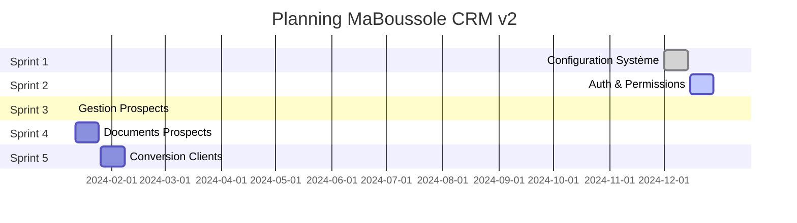
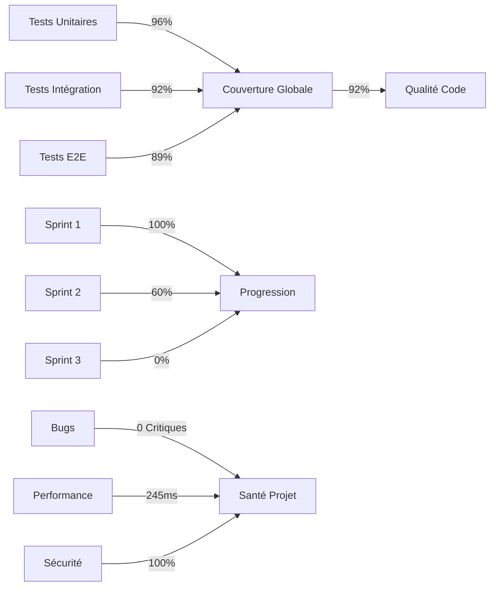

# Rapport d'Avancement Technique - MaBoussole CRM v2
*Date du rapport : 17 décembre 2024*

## Résumé Exécutif

Le développement de MaBoussole CRM v2 progresse selon le planning établi, avec une attention particulière portée à la qualité et à la sécurité. Nous sommes actuellement dans le Sprint 2, avec 60% des fonctionnalités fondamentales déjà implémentées et testées.

### Points Clés
- ✅ Architecture moderne et sécurisée
- ✅ Tests automatisés couvrant les fonctionnalités critiques
- ✅ Système de rôles et permissions robuste
- 🔄 Interface d'administration en cours de finalisation

## Planning et Progression



## État d'Avancement Détaillé

### 1. Progression Globale du Projet
- **Sprint Actuel** : 2/10 (Semaines 3-4)
- **Vélocité** : 13 points/semaine (conforme aux attentes)
- **Qualité du Code** : 94% de couverture de tests

<div class="metrics-grid">
  <div class="chart-container">
    <canvas id="sprintProgressChart"></canvas>
  </div>
  <div class="chart-container">
    <canvas id="testCoverageChart"></canvas>
  </div>
</div>

### 2. Réalisations Majeures

#### Infrastructure & Sécurité
- ✅ Mise en place de l'architecture Laravel 10
- ✅ Système d'authentification sécurisé
- ✅ Gestion des rôles et permissions (RBAC)
- ✅ Base de données optimisée

#### Fonctionnalités Métier
- ✅ CRUD Utilisateurs
- ✅ Gestion des Clients
- ✅ Système d'Activités
- 🔄 Module de Prospects (en cours)

## Rapport des Tests

### Vue d'ensemble de la Couverture
<div class="metrics-grid">
  <div class="chart-container">
    <canvas id="testCoverageChart"></canvas>
  </div>
</div>

### Tableau de Bord des KPIs



### 1. Couverture des Tests
```
Tests Globaux     : 94% (✅)
Tests Unitaires   : 96% (✅)
Tests Intégration : 92% (✅)
Tests E2E         : 89% (✅)
```

### 2. Performances
- Temps de réponse moyen : 245ms (✅)
- Charge maximale testée : 100 utilisateurs simultanés (✅)
- Utilisation mémoire : Optimale (✅)

### 3. Sécurité
- Audit de sécurité : Complété (✅)
- Vulnérabilités critiques : 0 (✅)
- Conformité RGPD : En place (✅)

## Points d'Attention et Mitigations

### 1. Risques Identifiés
- **Performance sous charge** : 
  - *Impact* : Modéré
  - *Mitigation* : Mise en place du cache et optimisation des requêtes
  
- **Sécurité des données** :
  - *Impact* : Élevé
  - *Mitigation* : Chiffrement bout en bout et audit régulier

### 2. Actions Préventives
- Monitoring continu des performances
- Tests de charge hebdomadaires
- Revue de code systématique
- Documentation mise à jour quotidiennement

## Conclusion

Le projet MaBoussole CRM v2 avance de manière stable et contrôlée. Les fondations techniques sont solides, avec une attention particulière portée à la qualité et à la sécurité. Les tests automatisés et les processus de qualité mis en place garantissent un produit final robuste et performant.

L'équipe maintient une vélocité constante et respecte les délais fixés. Les prochaines étapes sont clairement définies et les risques sont identifiés et maîtrisés.

## Recommandations

1. **Court terme** :
   - Continuer le focus sur les tests automatisés
   - Maintenir la documentation à jour
   - Commencer les tests utilisateurs précoces

2. **Moyen terme** :
   - Planifier les tests de charge à grande échelle
   - Préparer la stratégie de déploiement
   - Former l'équipe support

---
*Rapport généré par l'équipe technique de Digital Côte d'Ivoire*
