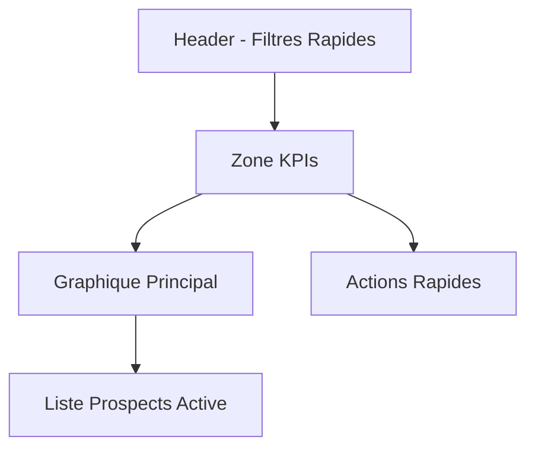

# Dashboard Prospects - Spécifications Visuelles

## Layout Principal


## Composants Visuels

### 1. Zone KPIs (Haut de page)
```yaml
Disposition: Flex, 4 cartes
KPIs Affichés:
  - Nouveaux Prospects (24h):
    Couleur: Bleu
    Icon: UserPlus
    Tendance: +/- vs hier
  
  - Taux Conversion:
    Couleur: Vert
    Icon: ChartBar
    Tendance: +/- vs mois dernier
  
  - En Attente Contact:
    Couleur: Orange
    Icon: Clock
    Alert: Si > 48h
  
  - Prospects Actifs:
    Couleur: Violet
    Icon: Users
    Tendance: +/- vs mois dernier
```

### 2. Graphique Principal
```yaml
Type: Area Chart
Données:
  X: Derniers 30 jours
  Y: Nombre de prospects
Séries:
  - Nouveaux Prospects
  - Conversions
  - En Attente
Interactivité:
  - Hover pour détails
  - Click pour filtrer liste
  - Période ajustable
```

### 3. Liste Prospects Active
```yaml
Colonnes:
  - Status:
    Type: Badge coloré
    Filtrable: Oui
  
  - Nom/Prénom:
    Type: Text + Avatar
    Searchable: Oui
  
  - Date Création:
    Type: Date relative
    Sortable: Oui
  
  - Dernière Action:
    Type: Timeline point
    Hover: Détails
  
  - Score:
    Type: Jauge colorée
    Filtrable: Oui
  
  - Actions:
    Type: Menu contextuel
    Options:
      - Contacter
      - Éditer
      - Convertir
      - Archiver
```

### 4. Actions Rapides
```yaml
Type: Speed Dial
Actions:
  - Nouveau Prospect
  - Import CSV
  - Export PDF
  - Rapport Mensuel
```

## Interactions Utilisateur

### 1. Filtres Rapides
```yaml
Type: Toggle Buttons
Options:
  - Tous (défaut)
  - Nouveaux (24h)
  - En Attente
  - Haute Priorité
  - Mes Prospects
```

### 2. Recherche Globale
```yaml
Type: Search Bar + Suggestions
Features:
  - Auto-complete
  - Recherche instantanée
  - Filtres avancés
  - Historique recherche
```

## États Visuels

### 1. Status Prospects
```yaml
Nouveau:
  Couleur: Bleu
  Icon: Star
  
En Attente:
  Couleur: Orange
  Icon: Clock
  
En Contact:
  Couleur: Vert
  Icon: Phone
  
À Relancer:
  Couleur: Rouge
  Icon: Bell
  
Converti:
  Couleur: Violet
  Icon: Check
```

### 2. Scores
```yaml
Échelle: 0-100
Couleurs:
  0-20: Rouge
  21-50: Orange
  51-80: Jaune
  81-100: Vert
```

## Responsive Design
```yaml
Desktop:
  - KPIs: 4 colonnes
  - Graphique: Pleine largeur
  - Liste: Table complète

Tablet:
  - KPIs: 2 colonnes
  - Graphique: Scrollable
  - Liste: Colonnes réduites

Mobile:
  - KPIs: 1 colonne
  - Graphique: Vue simplifiée
  - Liste: Vue carte
```

## Animations
```yaml
Transitions:
  - Changement filtres: Fade
  - Update KPIs: Counter
  - Hover actions: Scale
  - Status change: Pulse
```

## Performance
```yaml
Objectifs:
  - Chargement initial < 2s
  - Actualisation KPIs < 500ms
  - Filtrage liste < 200ms
  - Recherche < 300ms
```

---
> Ces spécifications serviront de référence pour l'implémentation du dashboard prospects.
> Dernière mise à jour : 2024-12-25
