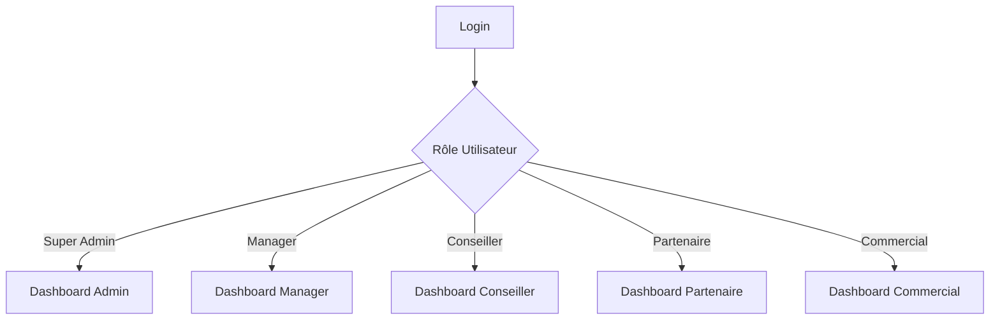

# Spécifications des Tableaux de Bord par Rôle

## Vue d'ensemble


## 1. Dashboard Super Admin

### Layout Principal
```yaml
Disposition: Grid 4x4
Sections:
  - Statistiques Globales
  - Performance Système
  - Activité Utilisateurs
  - Alertes Système
  - Métriques Financières
```

### Widgets
```yaml
KPIs Principaux:
  - Utilisateurs Actifs:
    Icon: 👥
    Couleur: Bleu
    Tendance: vs hier
  
  - Prospects Total:
    Icon: 🎯
    Couleur: Vert
    Tendance: vs mois dernier
    
  - Taux Conversion Global:
    Icon: 📈
    Couleur: Violet
    Tendance: vs mois dernier
    
  - Alertes Système:
    Icon: ⚠️
    Couleur: Rouge
    Badge: Nombre d'alertes

  - Chiffre d'Affaires Global:
    Icon: 💰
    Couleur: Or
    Période: Ce mois
    Comparaison: vs mois dernier
    
  - Commissions Versées:
    Icon: 💸
    Couleur: Vert
    Période: Ce mois
    Détails: Par type partenaire

  - Prévisions CA:
    Icon: 📊
    Couleur: Bleu
    Période: Mois prochain
    Base: Pipeline actuel

Graphiques:
  - Activité Système:
    Type: Line Chart
    Données: CPU, Mémoire, Requêtes/s
    
  - Conversions par Département:
    Type: Bar Chart
    Données: Taux par département
    
  - Distribution Utilisateurs:
    Type: Pie Chart
    Données: Par rôle

  - Performance Financière:
    Type: Line Chart
    Données: CA, Commissions, Marge
    Période: 12 derniers mois
    
  - Distribution Revenus:
    Type: Pie Chart
    Données: Par type de service
    Filtres: Période, Département

Listes:
  - Dernières Actions:
    Colonnes: Utilisateur, Action, Date
    
  - Logs Système:
    Colonnes: Type, Message, Date
    
  - Transactions Importantes:
    Colonnes: Client, Montant, Service, Date, Statut
    Filtres: Montant min, Période
    Export: Excel, PDF
```

## 2. Dashboard Manager

### Layout Principal
```yaml
Disposition: Grid 3x3
Sections:
  - KPIs Équipe
  - Suivi Prospects
  - Performance Conseillers
  - Métriques Financières
```

### Widgets
```yaml
KPIs Équipe:
  - Prospects en Cours:
    Icon: 🎯
    Couleur: Bleu
    Tendance: vs hier
    
  - Taux Conversion Équipe:
    Icon: 📈
    Couleur: Vert
    Tendance: vs mois
    
  - Temps Moyen Conversion:
    Icon: ⏱️
    Couleur: Orange
    Tendance: vs mois

  - CA Équipe:
    Icon: 💰
    Couleur: Or
    Période: Ce mois
    Comparaison: Objectif mensuel
    
  - Panier Moyen:
    Icon: 🛒
    Couleur: Vert
    Période: Ce mois
    Tendance: vs mois dernier
    
  - Pipeline Financier:
    Icon: 📈
    Couleur: Bleu
    Calcul: Prospects qualifiés × Taux conversion × Panier moyen
    Période: 3 mois glissants

Graphiques:
  - Performance Conseillers:
    Type: Bar Chart
    Données: Conversions par conseiller
    
  - Pipeline Prospects:
    Type: Funnel Chart
    Étapes: Nouveau → Qualifié → En cours → Converti
    
  - Activité Journalière:
    Type: Heat Map
    Données: Actions par heure/jour

  - Performance Financière Équipe:
    Type: Combined Chart
    Données:
      - CA réalisé (Bar)
      - Objectif (Line)
      - Prévision (Dashed Line)
    Période: 6 derniers mois
    
  - Distribution Services:
    Type: TreeMap
    Données: CA par type de service
    Interaction: Drill-down par conseiller

Listes:
  - Prospects Urgents:
    Colonnes: Nom, Statut, Délai, Conseiller
    
  - Dernières Conversions:
    Colonnes: Prospect, Date, Conseiller, Type
    
  - Top Dossiers:
    Colonnes: Prospect, Valeur Estimée, Conseiller, Probabilité, Date Prévue
    Tri: Par valeur potentielle
    Actions: Suivi prioritaire, Assignation rapide
```

## 3. Dashboard Conseiller

### Layout Principal
```yaml
Disposition: Grid 2x2
Sections:
  - Mes Prospects
  - Mes Tâches
  - Mes Performances
```

### Widgets
```yaml
KPIs Personnels:
  - Mes Prospects Actifs:
    Icon: 👥
    Couleur: Bleu
    Tendance: vs semaine
    
  - Taux Conversion Personnel:
    Icon: 📈
    Couleur: Vert
    Tendance: vs mois
    
  - Prospects à Contacter:
    Icon: 📞
    Couleur: Orange
    Badge: Nombre urgent

Graphiques:
  - Mes Conversions:
    Type: Line Chart
    Données: 6 derniers mois
    
  - État Prospects:
    Type: Doughnut Chart
    Statuts: Nouveau, En cours, Prêt, Bloqué

Listes:
  - Prospects Prioritaires:
    Colonnes: Nom, Statut, Dernière Action, Priorité
    
  - Tâches du Jour:
    Colonnes: Prospect, Action, Échéance
```

## 4. Dashboard Partenaire

### Layout Principal
```yaml
Disposition: Grid 2x2
Sections:
  - Mes Apports
  - Mes Commissions
  - Suivi Prospects
```

### Widgets
```yaml
KPIs Partenaire:
  - Prospects Apportés:
    Icon: 🤝
    Couleur: Bleu
    Période: Ce mois
    
  - Taux Conversion:
    Icon: 📈
    Couleur: Vert
    Tendance: vs mois
    
  - Commissions:
    Icon: 💰
    Couleur: Or
    Période: Ce mois

Graphiques:
  - Performance Mensuelle:
    Type: Bar Chart
    Données: Apports et conversions
    
  - Statut Prospects:
    Type: Pie Chart
    Données: Par état de traitement

Listes:
  - Derniers Apports:
    Colonnes: Prospect, Date, Statut, Commission
    
  - Prospects en Cours:
    Colonnes: Nom, État, Conseiller, Progression
```

## 5. Dashboard Commercial

### Layout Principal
```yaml
Disposition: Grid 2x2
Sections:
  - Mes Objectifs
  - Mes Prospects
  - Mes Bonus
```

### Widgets
```yaml
KPIs Commercial:
  - Nouveaux Prospects:
    Icon: 🎯
    Couleur: Bleu
    Période: Cette semaine
    
  - Progression Objectifs:
    Icon: 🎯
    Couleur: Vert
    Type: Jauge
    
  - Bonus Potentiel:
    Icon: 💎
    Couleur: Or
    Calcul: Ce mois

Graphiques:
  - Progression Objectifs:
    Type: Gauge Chart
    Données: % réalisé
    
  - Historique Prospects:
    Type: Line Chart
    Données: 3 derniers mois

Listes:
  - Prospects en Cours:
    Colonnes: Nom, Date, Statut, Potentiel
    
  - Historique Bonus:
    Colonnes: Mois, Objectif, Réalisé, Bonus
```

## Interactions et Navigation

### 1. Navigation Contextuelle
```yaml
Pour Chaque Dashboard:
  - Menu latéral adapté au rôle
  - Actions rapides contextuelles
  - Filtres période personnalisés
```

### 2. Actions Rapides
```yaml
Communes:
  - Nouveau Prospect
  - Recherche Globale
  - Notifications
  - Profil Utilisateur

Spécifiques par Rôle:
  Super Admin:
    - Gestion Utilisateurs
    - Logs Système
    - Configuration
    
  Manager:
    - Assignation Prospects
    - Rapports Équipe
    - Planning
    
  Conseiller:
    - Nouvelle Tâche
    - Contact Prospect
    - Notes Rapides
    
  Partenaire:
    - Nouvel Apport
    - Calcul Commission
    - Support
    
  Commercial:
    - Objectifs
    - Calcul Bonus
    - Rapport Activité
```

## Performance et Optimisation

### 1. Chargement
```yaml
Objectifs:
  - Premier affichage < 2s
  - Actualisation widgets < 500ms
  - Cache intelligent
  - Lazy loading des graphiques
```

### 2. Mise à jour des données
```yaml
Stratégie:
  - KPIs: Temps réel
  - Graphiques: 5 minutes
  - Listes: 2 minutes
  - Export: À la demande
```

## Notes Techniques

### 1. Implémentation
```yaml
Stack Technique:
  - Filament 3.x Widgets
  - Laravel Livewire
  - ApexCharts.js
  - TailwindCSS

Cache:
  - Redis pour KPIs
  - Cache applicatif pour graphiques
  - Session pour préférences
```

### 2. Sécurité
```yaml
Contrôles:
  - Vérification rôle par middleware
  - Données filtrées par scope
  - Audit des actions
  - Rate limiting sur API
```

---

> Cette spécification servira de référence pour l'implémentation des dashboards.
> Les widgets et layouts seront implémentés progressivement, en commençant par les KPIs essentiels.
> Dernière mise à jour : 2024-12-25
