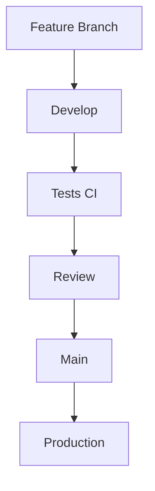
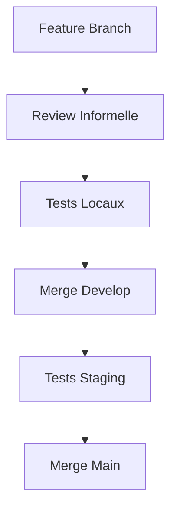
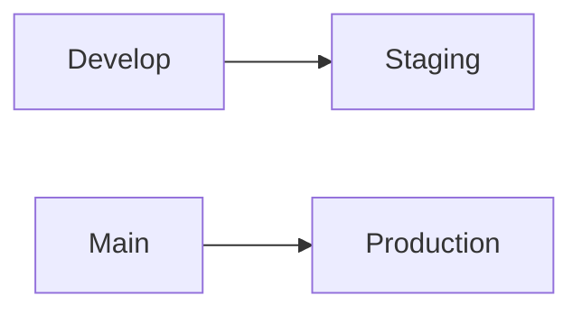

# Guide de Protection des Branches pour MaBoussole v2

## Introduction
Ce guide explique nos stratégies de protection des branches et les workflows de développement pour MaBoussole v2.

## Stratégies de Protection

### 1. Avec GitHub Pro


#### Configuration des Protections
- **Branche Main**
  ```yaml
  protections:
    - required_reviews: 1
    - required_checks: true
    - prevent_direct_push: true
  ```

- **Branche Develop**
  ```yaml
  protections:
    - required_checks: true
    - allow_lead_push: true
  ```

### 2. Par Convention d'Équipe


## Structure des Branches

### Branches Principales
```
main    → Production (https://crm-app.maboussole.net)
develop → Staging (https://staging-crm-app.maboussole.net)
```

### Branches de Travail
```
feature/ → Nouvelles fonctionnalités
fix/     → Corrections de bugs
docs/    → Documentation
```

## Workflow de Développement

### 1. Création de Branche
```bash
# Pour une nouvelle fonctionnalité
git checkout develop
git pull origin develop
git checkout -b feature/auth-google

# Pour un bug fix
git checkout -b fix/login-error
```

### 2. Développement
```bash
# Commits conventionnels
git commit -m "feat: ajout connexion Google"
git commit -m "fix: correction validation email"
```

### 3. Review et Tests
- **GitHub Pro** : Pull Request formelle
- **Convention** : Review par les pairs

### 4. Déploiement


## Bonnes Pratiques

### 1. Nommage des Branches
```
feature/auth-google     ✅
fix/login-error        ✅
random-changes         ❌
```

### 2. Messages de Commit
```bash
feat: nouvelle fonctionnalité
fix: correction de bug
docs: mise à jour documentation
style: formatage
refactor: refactorisation
test: ajout tests
```

### 3. Review de Code
- Vérifier la sécurité
- Tester les changements
- Documenter les modifications

## Déploiement Automatique

### Staging (develop)
```yaml
trigger:
  branch: develop
environment:
  url: staging-crm-app.maboussole.net
  debug: true
```

### Production (main)
```yaml
trigger:
  branch: main
environment:
  url: crm-app.maboussole.net
  debug: false
```

## Support et Questions

### Ressources
- Documentation Laravel
- GitHub Guides
- Slack : #dev-team

### Contact
- Lead Developer
- Tech Support
- Documentation Team
