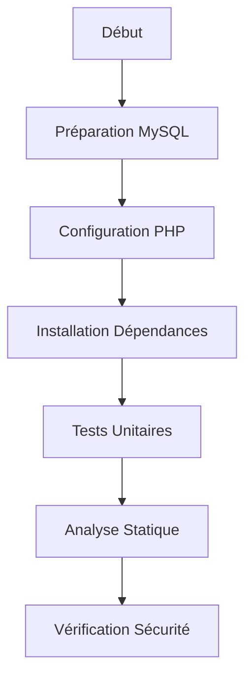
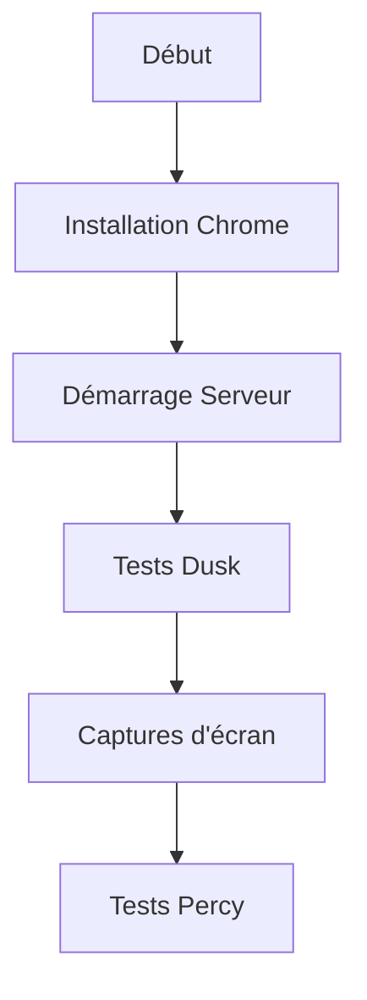

# Guide CI/CD pour MaBoussole v2

## Introduction
Ce guide explique notre pipeline d'Intégration Continue (CI) et de Déploiement Continu (CD) pour MaBoussole v2.

## Qu'est-ce que le CI/CD ?

### Intégration Continue (CI)
L'intégration continue est une pratique qui consiste à :
- Vérifier automatiquement chaque modification de code
- Exécuter des tests
- Valider la qualité du code
- Détecter les problèmes rapidement

### Déploiement Continu (CD)
Le déploiement continu permet de :
- Déployer automatiquement les modifications validées
- Assurer la cohérence entre les environnements
- Réduire les erreurs humaines

## Notre Pipeline CI/CD

### 1. Déclencheurs
Notre pipeline se déclenche automatiquement quand :
```yaml
on:
  push:
    branches: [ main, develop ]  # Push sur main ou develop
  pull_request:
    branches: [ main, develop ]  # PR vers main ou develop
```

### 2. Étapes du Pipeline

#### A. Tests Laravel (`laravel-tests`)


1. **Préparation de l'environnement**
   - Configuration de MySQL
   - Installation de PHP 8.2
   - Configuration de Node.js

2. **Installation des dépendances**
   ```bash
   composer install
   npm ci && npm run build
   ```

3. **Vérifications de qualité**
   - Style de code (Pint)
   - Analyse statique (PHPStan)
   - Audit de sécurité

4. **Tests unitaires**
   ```bash
   php artisan test
   ```

#### B. Tests Visuels (`dusk-tests`)


1. **Configuration**
   - Installation de Chrome Driver
   - Démarrage du serveur Laravel

2. **Exécution des tests**
   ```bash
   php artisan dusk
   ```

3. **Artefacts**
   - Captures d'écran en cas d'échec
   - Logs de console

#### C. Notifications (`notify`)
- Envoi des résultats sur Slack
- Notification des échecs

## Utilisation Pratique

### 1. Développement Local
```bash
# Avant de commiter
php artisan test        # Tests unitaires
php artisan dusk        # Tests visuels
./vendor/bin/pint      # Vérification style
```

### 2. Pull Requests
1. Créer une branche depuis `develop`
   ```bash
   git checkout -b feature/ma-feature
   ```

2. Développer et tester localement

3. Pousser et créer une PR
   ```bash
   git push origin feature/ma-feature
   ```

4. Attendre les résultats CI/CD

### 3. Déploiement
- Merge vers `develop` = déploiement staging
- Merge vers `main` = déploiement production

## Résolution des Problèmes Courants

### 1. Échec des Tests
```bash
# Voir les logs détaillés
php artisan test --verbose
php artisan dusk --verbose
```

### 2. Problèmes de Style
```bash
# Corriger automatiquement
./vendor/bin/pint
```

### 3. Échecs de Build
1. Vérifier les logs GitHub Actions
2. Reproduire localement
3. Corriger et repousser

## Bonnes Pratiques

1. **Commits**
   ```bash
   # ✅ Bon
   git commit -m "feat: ajoute le widget KPI"
   
   # ❌ À éviter
   git commit -m "fix"
   ```

2. **Tests**
   - Écrire les tests avant le code
   - Tester les cas limites
   - Vérifier visuellement

3. **Pull Requests**
   - Description claire
   - Screenshots si UI
   - Lier les issues

## Ressources
- [Documentation GitHub Actions](https://docs.github.com/fr/actions)
- [Laravel Dusk](https://laravel.com/docs/10.x/dusk)
- [PHPStan](https://phpstan.org/)
