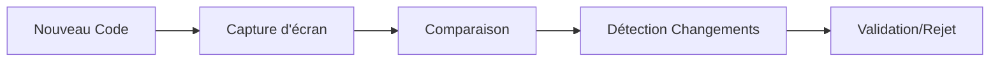

# Guide Percy.io pour MaBoussole v2

## Introduction
Percy.io est notre outil de test de régression visuelle. Il capture et compare automatiquement les captures d'écran de notre interface pour détecter les changements visuels non intentionnels.

## Pourquoi Percy.io ?

### 1. Détection Automatique


### 2. Avantages
- Détection précoce des régressions
- Validation visuelle automatisée
- Documentation visuelle du projet
- Historique des changements

## Configuration dans Notre Projet

### 1. Installation
```bash
# Installation de Percy
npm install --save-dev @percy/cli @percy/cypress

# Configuration initiale
npx percy config:create
```

### 2. Configuration
```yaml
# .percy.yml
version: 2
snapshot:
  widths: [375, 768, 1280]  # Mobile, Tablet, Desktop
  minHeight: 1024
  percyCSS: |
    .live-data { display: none; }
```

### 3. Intégration avec Dusk
```php
// tests/DuskTestCase.php
use Percy\Client;

class DuskTestCase extends BaseTestCase
{
    protected function captureSnapshot($name)
    {
        if (env('PERCY_ENABLED')) {
            Percy::snapshot($name, [
                'widths' => [375, 768, 1280],
                'minHeight' => 1024,
            ]);
        }
    }
}
```

## Utilisation

### 1. Tests Locaux
```bash
# Exporter le token Percy
export PERCY_TOKEN=votre_token_percy

# Lancer les tests avec Percy
npx percy exec -- php artisan dusk
```

### 2. Dans les Tests
```php
class DashboardTest extends DuskTestCase
{
    public function testDashboardLayout()
    {
        $this->browse(function (Browser $browser) {
            $browser->loginAs($this->admin)
                   ->visit('/admin')
                   ->waitFor('@stats-widget')
                   ->captureSnapshot('dashboard-admin');
        });
    }
}
```

### 3. Points de Contrôle Recommandés
```yaml
Dashboard:
  - État initial
  - Après chargement des données
  - États vides
  - États d'erreur
  - Différentes résolutions

Widgets:
  - KPIs
  - Graphiques
  - Tableaux
  - Filtres actifs
```

## Analyse des Résultats

### 1. Interface Percy


### 2. Types de Changements
```yaml
✅ Changements Attendus:
  - Nouveaux composants
  - Mises à jour design
  - Corrections bugs UI

❌ Changements Inattendus:
  - Décalages layout
  - Problèmes responsive
  - Erreurs CSS
```

### 3. Processus de Validation
1. Examiner les différences
2. Approuver/Rejeter les changements
3. Documenter les décisions

## Bonnes Pratiques

### 1. Nommage des Snapshots
```php
// ✅ Bon
$browser->captureSnapshot('dashboard-admin-empty-state');

// ❌ À éviter
$browser->captureSnapshot('test1');
```

### 2. Organisation des Tests
```php
// Grouper par fonctionnalité
class DashboardVisualTest extends DuskTestCase
{
    /** @test */
    public function dashboard_displays_correctly_for_all_roles()
    {
        // Tests par rôle
    }

    /** @test */
    public function dashboard_handles_empty_states()
    {
        // Tests états vides
    }
}
```

### 3. Gestion des Données Dynamiques
```css
/* percy.css */
.timestamp { visibility: hidden; }
.random-data { opacity: 0; }
```

## Résolution des Problèmes

### 1. Snapshots Instables
```yaml
Causes Possibles:
  - Données dynamiques
  - Animations
  - Timing

Solutions:
  - Masquer éléments dynamiques
  - Attendre le chargement
  - Désactiver animations
```

### 2. Faux Positifs
```yaml
Stratégies:
  - Ignorer zones spécifiques
  - Ajuster seuils de différence
  - Filtrer éléments dynamiques
```

## Workflow Quotidien

### 1. Développement
```bash
# Avant de commiter
php artisan dusk  # Tests locaux
npx percy exec -- php artisan dusk  # Vérification visuelle
```

### 2. Review
1. Examiner les changements dans Percy
2. Valider les modifications intentionnelles
3. Investiguer les différences inattendues

### 3. Documentation
```markdown
# PR Description
## Changements Visuels
- [ ] KPI Widget redesign
- [ ] Responsive fixes
- [ ] New empty state

## Percy Links
- [Dashboard Compare](percy-link)
- [Widget Compare](percy-link)
```

## Ressources
- [Documentation Percy](https://docs.percy.io)
- [Percy + Laravel Dusk](https://docs.percy.io/docs/laravel-dusk)
- [Exemples de Tests](https://github.com/percy/example-percy-laravel-dusk)
