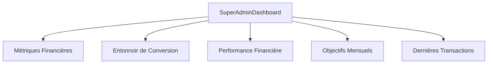
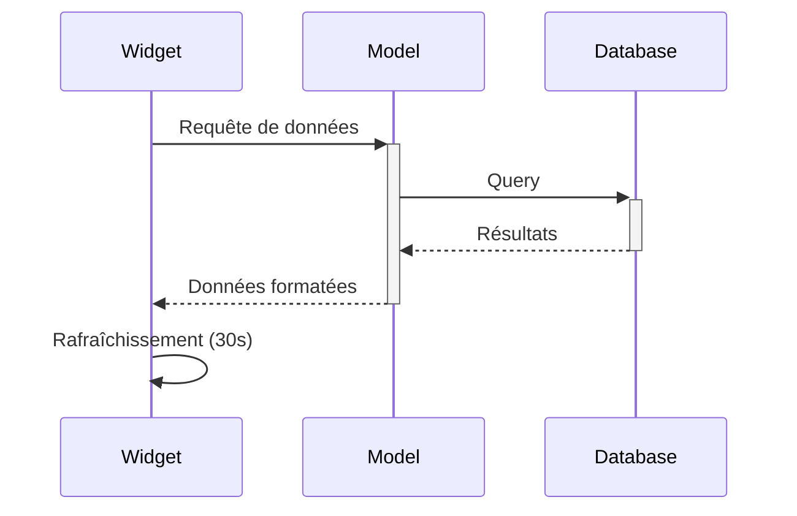

# Concepts du Tableau de Bord Super Admin

## Architecture Générale

Le tableau de bord est construit sur le concept de widgets Filament, chacun représentant une vue spécifique des données :



## Composants Principaux

### 1. Métriques Financières
- **Objectif** : Suivi en temps réel des performances financières
- **Données** : CA, commissions, pipeline prévisionnel
- **Mise à jour** : Automatique toutes les 30 secondes

### 2. Entonnoir de Conversion
- **Objectif** : Visualisation du parcours prospect
- **Étapes** : Nouveau → Contacté → Qualifié → Signé
- **Indicateurs** : Taux de conversion entre chaque étape

### 3. Performance Financière
- **Objectif** : Analyse des tendances sur 6 mois
- **Visualisation** : Graphique linéaire interactif
- **Données** : Agrégation mensuelle du CA

### 4. Objectifs Mensuels
- **Objectif** : Suivi des KPIs principaux
- **Métriques** : CA, prospects, taux de conversion
- **Représentation** : Jauges de progression

### 5. Dernières Transactions
- **Objectif** : Vue détaillée des transactions récentes
- **Données** : Clients, montants, statuts
- **Fonctionnalités** : Tri et filtrage

## Flux de Données



## Logique Métier

### Calcul des Commissions
```php
commission = chiffreAffaires * TAUX_COMMISSION
```

### Pipeline Prévisionnel
```php
pipeline = prospectsQualifiés * montantMoyenContrat
```

### Taux de Conversion
```php
tauxConversion = (clientsConvertis / totalProspects) * 100
```

## Sécurité et Accès

- Restriction au rôle `super-admin`
- Protection CSRF sur toutes les requêtes
- Validation des données en temps réel

## Extensibilité

Le dashboard est conçu pour être facilement extensible :
- Widgets indépendants et modulaires
- Interface standardisée pour les données
- Système de hooks pour les événements
