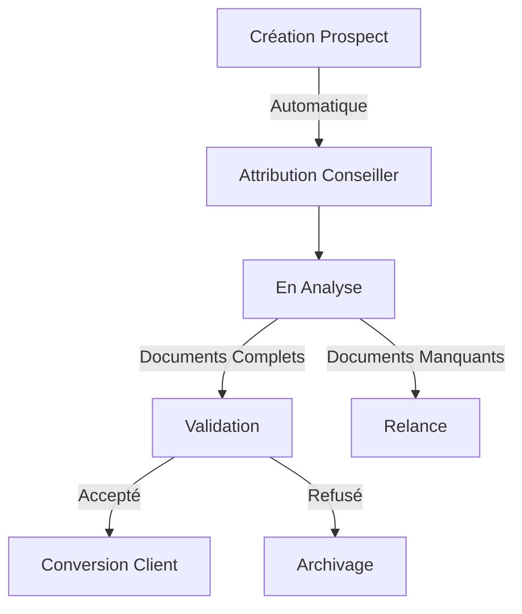

# Module Prospects - Documentation Complète

## Vue d'Ensemble

### Objectif du Module
Le module Prospects est le cœur du CRM MaBoussole, gérant le cycle de vie complet des prospects depuis leur création jusqu'à leur conversion en clients.

### Concepts Clés Laravel/Filament
```yaml
Laravel:
  - Models & Migrations
  - Relationships
  - Form Requests
  - Events & Listeners

Filament:
  - Resources
  - Forms & Tables
  - Actions
  - Notifications
```

### Diagramme de Flux


## Structure Technique

### Models
```php
# Prospect.php
- Attributs principaux
- Relations (Conseiller, Documents)
- Statuts et transitions
- Events et observers

# ProspectStatus.php
- Énumérations des statuts
- Méthodes de transition
- Validation des changements

# ProspectDocument.php
- Gestion des pièces jointes
- Validation des fichiers
- Stockage sécurisé
```

### Resources Filament
```yaml
ProspectResource:
  - Liste paginée avec filtres
  - Formulaire de création/édition
  - Actions contextuelles
  - Tableaux de bord KPI

Pages:
  - ListProspects
  - CreateProspect
  - EditProspect
  - ViewProspect
```

## Points d'Apprentissage

### Concepts Laravel
1. **Modèles Eloquent**
   - Relations polymorphiques
   - Accesseurs/Mutateurs
   - Events et Observers

2. **Validation**
   - Form Requests
   - Règles personnalisées
   - Messages en français

### Concepts Filament
1. **Resources**
   - Configuration
   - Forms et Tables
   - Actions personnalisées

2. **Interface**
   - Composants Filament
   - Responsive Design
   - Thème personnalisé

## Tests

### Types de Tests
```yaml
Unit:
  - Modèles
  - Services
  - Validations

Feature:
  - Création prospect
  - Workflow statuts
  - Upload documents

Browser:
  - Interface utilisateur
  - Interactions formulaires
  - Responsive design
```

## Sécurité

### Points d'Attention
1. **Autorisations**
   - Policies Laravel
   - Permissions Filament
   - Validation accès

2. **Données Sensibles**
   - Validation inputs
   - Protection fichiers
   - Logs sécurisés

## Guide d'Implémentation

### Étapes de Développement
1. **Structure de Base**
   - Migrations
   - Modèles
   - Relations

2. **Interface Admin**
   - Resource Filament
   - Forms & Tables
   - Actions

3. **Logique Métier**
   - Workflow statuts
   - Attribution conseillers
   - Gestion documents

4. **Tests & Validation**
   - Tests unitaires
   - Tests fonctionnels
   - Documentation

## Bonnes Pratiques

### Standards de Code
```yaml
Nommage:
  - Français pour interface
  - Anglais pour code
  - Conventions PSR-12

Documentation:
  - PHPDoc complet
  - Commentaires explicatifs
  - Examples d'utilisation

Tests:
  - Un test par fonctionnalité
  - Nommage explicite
  - Données de test réalistes
```

## Intégrations

### Points de Contact
1. **Module Clients**
   - Conversion prospect
   - Transfert données
   - Historique

2. **Module Notifications**
   - Alertes attribution
   - Rappels documents
   - Notifications statuts

## Maintenance

### Points de Surveillance
```yaml
Performance:
  - Requêtes N+1
  - Cache opportuniste
  - Indexation DB

Monitoring:
  - Logs erreurs
  - Métriques usage
  - Points bloquants
```
