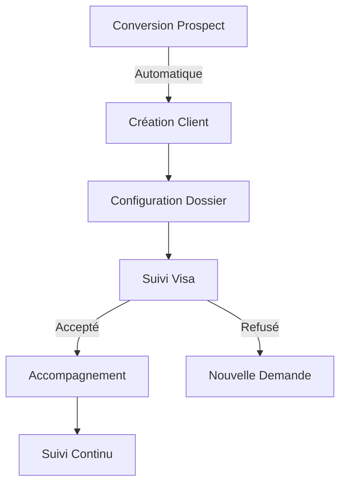

# Module Clients - Documentation Complète

## Vue d'Ensemble

### Objectif du Module
Le module Clients gère les prospects convertis et leur suivi dans le processus de visa et d'accompagnement. C'est une extension naturelle du module Prospects, avec des fonctionnalités plus avancées pour le suivi client.

### Concepts Clés Laravel/Filament
```yaml
Laravel:
  - Models & Relations
  - Events & Notifications
  - Services & Actions
  - Policies & Permissions

Filament:
  - Resources & Relations
  - Widgets & Dashboards
  - Actions & Modals
  - Custom Pages
```

### Diagramme de Flux


## Structure Technique

### Composants Principaux
```yaml
Models:
  - Client.php
  - ClientDocument.php
  - ClientStatus.php
  - VisaApplication.php

Resources:
  - ClientResource.php
  - Pages/
    - ListClients.php
    - CreateClient.php
    - EditClient.php
    - ViewClient.php

Services:
  - ClientService.php
  - VisaService.php
  - DocumentService.php
```
