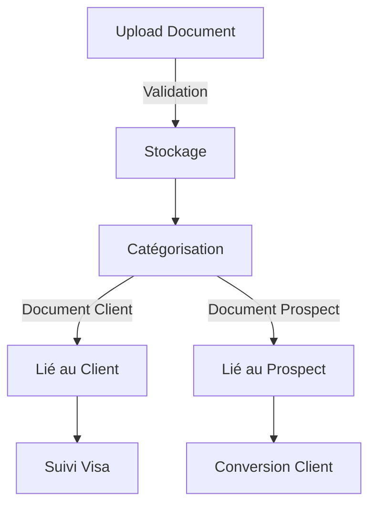

# Module Documents - Documentation Complète

## Vue d'Ensemble

### Objectif du Module
Le module Documents gère l'ensemble des documents dans le CRM MaBoussole, permettant le stockage, la catégorisation et le suivi des documents pour les prospects et les clients. Il est crucial pour le processus de visa et le suivi administratif.

### Concepts Clés Laravel/Filament
```yaml
Laravel:
  - Polymorphic Relations
  - File Storage
  - Model Events
  - Validation

Filament:
  - File Upload
  - Preview/Download
  - Document Management
  - Status Tracking
```

### Diagramme de Flux


## Structure Technique

### Composants Principaux
```yaml
Models:
  - Document.php
  - DocumentCategory.php
  - DocumentType.php

Resources:
  - DocumentResource.php
  - Pages/
    - ListDocuments.php
    - CreateDocument.php
    - EditDocument.php
    - ViewDocument.php

Services:
  - DocumentService.php
  - FileStorageService.php
  - ValidationService.php
```

## Points d'Apprentissage

### 1. Gestion des Fichiers
- Upload sécurisé
- Stockage optimisé
- Validation des types
- Gestion des versions

### 2. Relations Polymorphiques
- Liaison flexible
- Association multiple
- Intégrité des données

### 3. Interface Utilisateur
- Upload intuitif
- Prévisualisation
- Organisation claire
- Actions rapides

## Intégrations

### 1. Module Prospects
- Documents requis
- Validation statut
- Conversion client

### 2. Module Clients
- Suivi visa
- Documents administratifs
- Historique

### 3. Module Notifications
- Alertes documents manquants
- Rappels expiration
- Confirmations upload

## Sécurité

### Points d'Attention
```yaml
Upload:
  - Validation types fichiers
  - Taille maximale
  - Scan antivirus
  - Noms sécurisés

Stockage:
  - Encryption données
  - Accès contrôlé
  - Backup régulier
  - Purge automatique

Permissions:
  - Accès utilisateur
  - Actions autorisées
  - Audit trail
```

## Maintenance

### Tâches Régulières
1. **Nettoyage**
   - Documents obsolètes
   - Fichiers temporaires
   - Versions anciennes

2. **Vérification**
   - Intégrité fichiers
   - Liens valides
   - Permissions correctes

3. **Optimisation**
   - Compression fichiers
   - Index base données
   - Cache système
