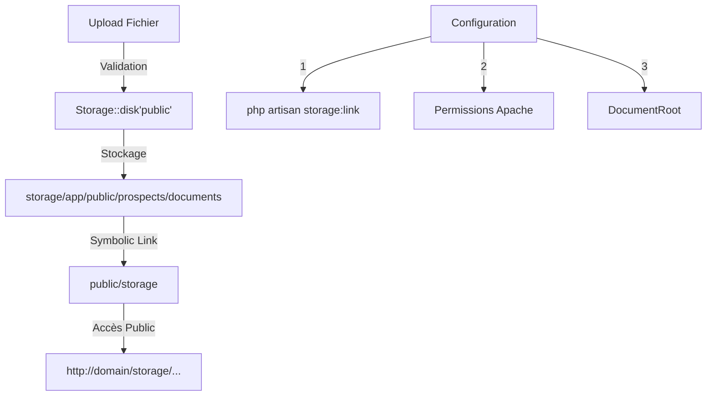

# Configuration du Stockage des Documents

## Vue d'Ensemble

### Objectif
Ce guide explique comment le système de stockage des documents fonctionne dans MaBoussole CRM, en mettant l'accent sur la configuration correcte et la résolution des problèmes courants.

### Concepts Clés
```yaml
Laravel:
  - File Storage System
  - Symbolic Links
  - File Permissions
  - Public Storage

Apache:
  - DocumentRoot
  - File Access
  - Directory Permissions
```

### Diagramme de Flux


## Configuration Technique

### 1. Structure des Dossiers
```bash
project/
├── storage/
│   └── app/
│       └── public/
│           └── prospects/
│               └── documents/  # Stockage physique
└── public/
    └── storage/  # Lien symbolique
```

### 2. Configuration Requise

#### Laravel Storage
```php
// config/filesystems.php
'public' => [
    'driver' => 'local',
    'root' => storage_path('app/public'),
    'url' => env('APP_URL').'/storage',
    'visibility' => 'public',
],
```

#### Permissions Apache
```bash
# Permissions nécessaires
sudo chown -R www-data:www-data storage bootstrap/cache
sudo chmod -R 775 storage bootstrap/cache
```

## Guide de Dépannage

### 1. Erreur "Not Found"
#### Symptômes
- Les fichiers uploadés ne sont pas accessibles via l'URL
- Erreur 404 dans le navigateur

#### Solutions
1. Vérifier le lien symbolique :
```bash
# Recréer si nécessaire
php artisan storage:link
```

2. Vérifier les permissions :
```bash
ls -la storage/app/public
ls -la public/storage
```

3. Vérifier la configuration Apache :
```apache
# Exemple de VirtualHost correct
<VirtualHost *:80>
    DocumentRoot /chemin/vers/projet/public
    <Directory /chemin/vers/projet/public>
        AllowOverride All
        Require all granted
    </Directory>
</VirtualHost>
```

### 2. Problèmes de Permission
#### Symptômes
- Erreurs lors de l'upload
- Fichiers non accessibles après upload

#### Solutions
```bash
# 1. Vérifier le propriétaire
ls -la storage/app/public

# 2. Corriger les permissions
sudo chown -R www-data:www-data storage
sudo chmod -R 775 storage

# 3. Ajouter votre utilisateur au groupe
sudo usermod -a -G www-data votre_utilisateur
```

## Bonnes Pratiques

### 1. Sécurité
- Toujours valider les types de fichiers acceptés
- Limiter la taille des fichiers
- Ne jamais stocker de fichiers sensibles dans le dossier public

### 2. Organisation
- Utiliser des sous-dossiers par type de document
- Implémenter une nomenclature cohérente
- Nettoyer régulièrement les fichiers temporaires

### 3. Performance
- Configurer le cache pour les fichiers statiques
- Optimiser les images avant stockage
- Utiliser un CDN pour les gros fichiers

## Exemple d'Implémentation

### Upload de Document
```php
use Illuminate\Support\Facades\Storage;

public function store(Request $request)
{
    $path = $request->file('document')->store('prospects/documents', 'public');
    
    return Document::create([
        'path' => $path,
        'name' => $request->file('document')->getClientOriginalName(),
        'type' => $request->file('document')->getClientMimeType(),
    ]);
}
```

### Configuration Filament
```php
use Filament\Forms\Components\FileUpload;

FileUpload::make('documents')
    ->directory('prospects/documents')
    ->visibility('public')
    ->multiple()
    ->enableDownload()
    ->enableOpen()
    ->preserveFilenames()
```

## Tests et Validation

### Test des Permissions
```bash
# Script de vérification
#!/bin/bash
echo "Vérification des permissions..."
ls -la storage/app/public
ls -la public/storage
echo "Vérification du lien symbolique..."
readlink public/storage
```

### Test d'Upload
```php
public function test_document_upload()
{
    Storage::fake('public');

    $response = $this->post('/upload', [
        'document' => UploadedFile::fake()->create('document.pdf', 100)
    ]);

    Storage::disk('public')->assertExists('prospects/documents/document.pdf');
}
```
