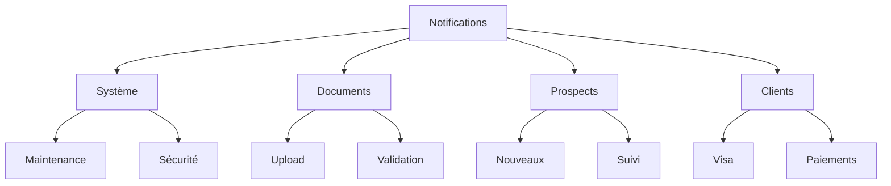
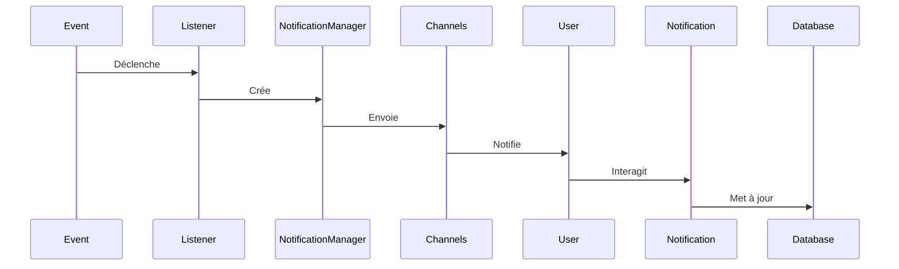

# Module Notifications - Documentation Complète

## Vue d'Ensemble

### Objectif du Module
Le module Notifications gère l'ensemble des notifications dans le CRM MaBoussole, assurant une communication efficace avec les utilisateurs et le suivi des événements importants du système.

### Concepts Clés Laravel/Filament
```yaml
Laravel:
  - Notification System
  - Events & Listeners
  - Queues
  - Channels

Filament:
  - Notifications UI
  - Real-time Updates
  - Action Handlers
```

### Types de Notifications



## Architecture

### Composants Principaux
```yaml
Core:
  - NotificationManager
  - NotificationChannels
  - NotificationTemplates

Channels:
  - Database
  - Email
  - Real-time
  - SMS (optionnel)

Types:
  - SystemNotification
  - DocumentNotification
  - ProspectNotification
  - ClientNotification
```

### Flux de Notifications


## Points d'Apprentissage

### 1. Système de Notifications Laravel
- Création de notifications
- Configuration des canaux
- Gestion des files d'attente
- Templates personnalisés

### 2. Intégration Filament
- Interface utilisateur
- Actions temps réel
- Gestion des états
- Personnalisation visuelle

### 3. Bonnes Pratiques
```yaml
Performance:
  - Queue Workers
  - Rate Limiting
  - Batch Processing

Maintenance:
  - Log Rotation
  - Purge Automatique
  - Monitoring

Sécurité:
  - Validation Input
  - Sanitization
  - Rate Protection
```

## Intégrations

### 1. Module Prospects
```yaml
Notifications:
  - Nouveau prospect
  - Mise à jour statut
  - Rappels suivi
  - Actions requises
```

### 2. Module Clients
```yaml
Notifications:
  - Conversion prospect
  - Statut visa
  - Paiements
  - Documents requis
```

### 3. Module Documents
```yaml
Notifications:
  - Upload réussi
  - Validation requise
  - Document validé
  - Document rejeté
```

## Configuration

### 1. Canaux
```php
// config/notifications.php
return [
    'channels' => [
        'database' => [
            'table' => 'notifications',
            'purge_after' => '30 days',
        ],
        'mail' => [
            'template' => 'notifications.email',
            'from' => [
                'address' => 'noreply@maboussole.com',
                'name' => 'MaBoussole CRM',
            ],
        ],
        'real_time' => [
            'driver' => 'pusher',
            'rate_limit' => 60,
        ],
    ],
];
```

### 2. Files d'Attente
```yaml
Queues:
  - notifications-high: Priorité élevée
  - notifications-default: Priorité normale
  - notifications-low: Priorité basse
```

### 3. Templates
```yaml
Structure:
  - Email Templates
  - SMS Templates
  - Push Templates
  - In-App Templates
```

## Maintenance

### Tâches Régulières
1. **Nettoyage**
   - Anciennes notifications
   - Logs d'envoi
   - Files d'attente

2. **Monitoring**
   - Taux de succès
   - Temps de réponse
   - Erreurs d'envoi

3. **Optimisation**
   - Performance queues
   - Utilisation cache
   - Indexation DB

## Sécurité

### Points d'Attention
```yaml
Protection:
  - Rate Limiting
  - Validation Input
  - Sanitization Output

Confidentialité:
  - Données sensibles
  - Canaux sécurisés
  - Logs sécurisés

Audit:
  - Traçabilité
  - Historique
  - Conformité
```

## Développement

### Création Notification
```php
php artisan make:notification ProspectCreated
php artisan make:notification DocumentValidated
php artisan make:notification ClientPayment
```

### Tests
```yaml
Couverture:
  - Envoi notifications
  - Réception canaux
  - Actions utilisateur
  - Files d'attente
```

### Documentation API
```yaml
Endpoints:
  - GET /notifications
  - POST /notifications/mark-as-read
  - DELETE /notifications
  - GET /notifications/unread-count
```
