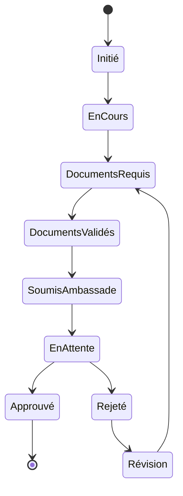

# Module Workflow Visa - Documentation Complète

## Vue d'Ensemble

### Objectif du Module
Le module Workflow Visa gère le processus complet de demande et de suivi des visas dans le CRM MaBoussole, assurant un suivi efficace et une gestion structurée des dossiers clients.

### Concepts Clés Laravel/Filament
```yaml
Laravel:
  - State Machines
  - Events & Listeners
  - Policies
  - Notifications

Filament:
  - Workflow UI
  - Status Management
  - Document Handling
  - Timeline Views
```

### Diagramme du Workflow



## Structure Technique

### Composants Principaux
```yaml
Models:
  - VisaApplication.php
  - VisaRequirement.php
  - VisaDocument.php
  - VisaTimeline.php

Resources:
  - VisaApplicationResource.php
  - Pages/
    - ListVisaApplications.php
    - CreateVisaApplication.php
    - EditVisaApplication.php
    - ViewVisaApplication.php

Services:
  - VisaWorkflowService.php
  - DocumentValidationService.php
  - RequirementCheckService.php
```

## Points d'Apprentissage

### 1. Gestion des États
```yaml
États Visa:
  - Initié
  - En Cours
  - Documents Requis
  - Documents Validés
  - Soumis Ambassade
  - En Attente
  - Approuvé
  - Rejeté
  - Révision
```

### 2. Validation Documents
```yaml
Process:
  - Liste documents requis
  - Upload documents
  - Vérification conformité
  - Validation documents
  - Historique modifications
```

### 3. Timeline
```yaml
Événements:
  - Création dossier
  - Changements statut
  - Ajouts documents
  - Communications ambassade
  - Décisions visa
```

## Intégrations

### 1. Module Clients
```yaml
Interactions:
  - Données client
  - Documents personnels
  - Historique voyages
  - Statut financier
```

### 2. Module Documents
```yaml
Gestion:
  - Documents requis
  - Validation pièces
  - Stockage sécurisé
  - Versions documents
```

### 3. Module Notifications
```yaml
Alertes:
  - Documents manquants
  - Dates importantes
  - Changements statut
  - Décisions visa
```

## Workflow Détaillé

### 1. Initiation
```yaml
Étapes:
  - Création dossier
  - Vérification éligibilité
  - Liste documents requis
  - Planning prévisionnel
```

### 2. Collecte Documents
```yaml
Process:
  - Liste contrôle
  - Upload documents
  - Validation format
  - Vérification complétude
```

### 3. Soumission
```yaml
Actions:
  - Vérification finale
  - Préparation dossier
  - Soumission ambassade
  - Suivi demande
```

### 4. Suivi
```yaml
Points:
  - État demande
  - Communications
  - Délais traitement
  - Mises à jour statut
```

## Sécurité

### Points d'Attention
```yaml
Protection:
  - Données personnelles
  - Documents sensibles
  - Accès contrôlé
  - Audit trail

Conformité:
  - RGPD
  - Lois immigration
  - Règles ambassade
  - Standards sécurité
```

## Maintenance

### Tâches Régulières
1. **Nettoyage**
   - Dossiers obsolètes
   - Documents expirés
   - Historique ancien

2. **Vérification**
   - États workflow
   - Intégrité données
   - Cohérence statuts

3. **Optimisation**
   - Performance workflow
   - Temps traitement
   - Utilisation ressources

## Développement

### Création États
```php
php artisan make:state VisaInitiated
php artisan make:state VisaDocumentsRequired
php artisan make:state VisaSubmitted
```

### Tests
```yaml
Couverture:
  - Transitions état
  - Validation documents
  - Notifications
  - Permissions
```

### Documentation API
```yaml
Endpoints:
  - GET /visa-applications
  - POST /visa-applications
  - PUT /visa-applications/{id}/state
  - GET /visa-applications/{id}/timeline
```

## Interface Utilisateur

### 1. Vue d'Ensemble
```yaml
Composants:
  - Liste demandes
  - Timeline visa
  - État documents
  - Actions rapides
```

### 2. Actions Contextuelles
```yaml
Options:
  - Changement état
  - Upload document
  - Validation pièce
  - Communication client
```

### 3. Tableaux de Bord
```yaml
Métriques:
  - Demandes en cours
  - Documents manquants
  - Délais moyens
  - Taux succès
```
