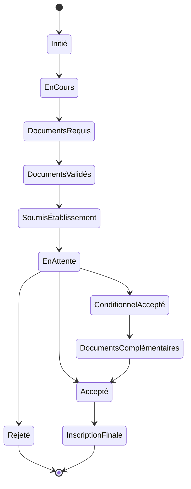

# Module Workflow Admission - Documentation Complète

## Vue d'Ensemble

### Objectif du Module
Le module Workflow Admission gère le processus complet de demande et de suivi des admissions dans les établissements d'enseignement, assurant un suivi efficace des candidatures et une gestion structurée des dossiers d'admission.

### Concepts Clés Laravel/Filament
```yaml
Laravel:
  - State Machines
  - Events & Listeners
  - Policies
  - Notifications

Filament:
  - Workflow UI
  - Status Management
  - Document Handling
  - Timeline Views
```

### Diagramme du Workflow



## Structure Technique

### Composants Principaux
```yaml
Models:
  - AdmissionApplication.php
  - AdmissionRequirement.php
  - AdmissionDocument.php
  - AdmissionTimeline.php
  - Institution.php
  - Program.php

Resources:
  - AdmissionApplicationResource.php
  - Pages/
    - ListAdmissionApplications.php
    - CreateAdmissionApplication.php
    - EditAdmissionApplication.php
    - ViewAdmissionApplication.php

Services:
  - AdmissionWorkflowService.php
  - DocumentValidationService.php
  - RequirementCheckService.php
```

## Points d'Apprentissage

### 1. Gestion des États
```yaml
États Admission:
  - Initié
  - En Cours
  - Documents Requis
  - Documents Validés
  - Soumis Établissement
  - En Attente
  - Accepté
  - Conditionnel Accepté
  - Documents Complémentaires
  - Rejeté
  - Inscription Finale
```

### 2. Validation Documents
```yaml
Process:
  - Liste documents requis
  - Upload documents
  - Vérification conformité
  - Validation documents
  - Historique modifications
```

### 3. Timeline
```yaml
Événements:
  - Création dossier
  - Changements statut
  - Ajouts documents
  - Communications établissement
  - Décisions admission
```

## Intégrations

### 1. Module Clients
```yaml
Interactions:
  - Données étudiant
  - Documents personnels
  - Historique académique
  - Statut financier
```

### 2. Module Documents
```yaml
Gestion:
  - Documents requis
  - Validation pièces
  - Stockage sécurisé
  - Versions documents
```

### 3. Module Notifications
```yaml
Alertes:
  - Documents manquants
  - Dates importantes
  - Changements statut
  - Décisions admission
```

## Workflow Détaillé

### 1. Initiation
```yaml
Étapes:
  - Création dossier
  - Choix établissement
  - Choix programme
  - Planning admission
```

### 2. Collecte Documents
```yaml
Process:
  - Liste contrôle
  - Upload documents
  - Validation format
  - Vérification complétude
```

### 3. Soumission
```yaml
Actions:
  - Vérification finale
  - Préparation dossier
  - Soumission établissement
  - Suivi candidature
```

### 4. Suivi
```yaml
Points:
  - État candidature
  - Communications
  - Délais traitement
  - Mises à jour statut
```

## Sécurité

### Points d'Attention
```yaml
Protection:
  - Données personnelles
  - Documents sensibles
  - Accès contrôlé
  - Audit trail

Conformité:
  - RGPD
  - Règles établissement
  - Standards académiques
  - Sécurité données
```

## Maintenance

### Tâches Régulières
1. **Nettoyage**
   - Dossiers obsolètes
   - Documents expirés
   - Historique ancien

2. **Vérification**
   - États workflow
   - Intégrité données
   - Cohérence statuts

3. **Optimisation**
   - Performance workflow
   - Temps traitement
   - Utilisation ressources

## Développement

### Création États
```php
php artisan make:state AdmissionInitiated
php artisan make:state AdmissionDocumentsRequired
php artisan make:state AdmissionSubmitted
```

### Tests
```yaml
Couverture:
  - Transitions état
  - Validation documents
  - Notifications
  - Permissions
```

### Documentation API
```yaml
Endpoints:
  - GET /admission-applications
  - POST /admission-applications
  - PUT /admission-applications/{id}/state
  - GET /admission-applications/{id}/timeline
```

## Interface Utilisateur

### 1. Vue d'Ensemble
```yaml
Composants:
  - Liste candidatures
  - Timeline admission
  - État documents
  - Actions rapides
```

### 2. Actions Contextuelles
```yaml
Options:
  - Changement état
  - Upload document
  - Validation pièce
  - Communication établissement
```

### 3. Tableaux de Bord
```yaml
Métriques:
  - Candidatures en cours
  - Documents manquants
  - Délais moyens
  - Taux acceptation
```

## Établissements et Programmes

### 1. Gestion Établissements
```yaml
Informations:
  - Nom
  - Localisation
  - Contact
  - Programmes
  - Exigences spécifiques
```

### 2. Gestion Programmes
```yaml
Détails:
  - Nom programme
  - Niveau études
  - Durée
  - Coût
  - Prérequis
```

### 3. Dates Importantes
```yaml
Types:
  - Date limite candidature
  - Début sessions
  - Examens requis
  - Orientation
```

## Communication

### 1. Templates
```yaml
Types:
  - Confirmation candidature
  - Demande documents
  - Décision admission
  - Instructions inscription
```

### 2. Suivi
```yaml
Points:
  - Emails envoyés
  - Documents reçus
  - Réponses établissement
  - Questions candidat
```

## Reporting

### 1. Statistiques
```yaml
Métriques:
  - Taux acceptation
  - Temps traitement
  - Conversion finale
  - Performance programme
```

### 2. Analyses
```yaml
Types:
  - Tendances admission
  - Efficacité process
  - Points blocage
  - Satisfaction candidat
```
