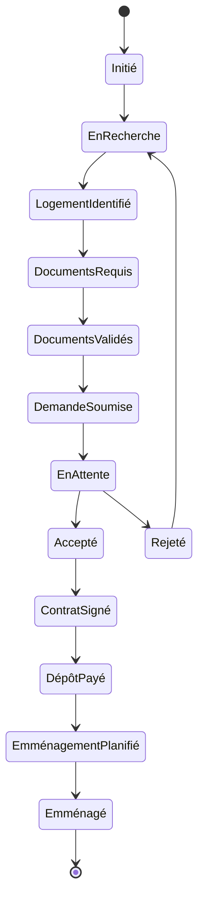

# Module Workflow Logement - Documentation Complète

## Vue d'Ensemble

### Objectif du Module
Le module Workflow Logement gère le processus complet de recherche, demande et suivi des logements étudiants, assurant une gestion efficace des demandes de logement et une coordination avec les résidences et propriétaires.

### Concepts Clés Laravel/Filament
```yaml
Laravel:
  - State Machines
  - Events & Listeners
  - Policies
  - Notifications

Filament:
  - Workflow UI
  - Status Management
  - Document Handling
  - Timeline Views
```

### Diagramme du Workflow



## Structure Technique

### Composants Principaux
```yaml
Models:
  - HousingApplication.php
  - Housing.php
  - HousingRequirement.php
  - HousingDocument.php
  - HousingTimeline.php
  - Residence.php
  - Landlord.php

Resources:
  - HousingApplicationResource.php
  - HousingResource.php
  - ResidenceResource.php
  - LandlordResource.php
  - Pages/
    - ListHousingApplications.php
    - CreateHousingApplication.php
    - EditHousingApplication.php
    - ViewHousingApplication.php

Services:
  - HousingWorkflowService.php
  - DocumentValidationService.php
  - RequirementCheckService.php
```

## Points d'Apprentissage

### 1. Gestion des États
```yaml
États Logement:
  - Initié
  - En Recherche
  - Logement Identifié
  - Documents Requis
  - Documents Validés
  - Demande Soumise
  - En Attente
  - Accepté
  - Rejeté
  - Contrat Signé
  - Dépôt Payé
  - Emménagement Planifié
  - Emménagé
```

### 2. Validation Documents
```yaml
Process:
  - Liste documents requis
  - Upload documents
  - Vérification conformité
  - Validation documents
  - Historique modifications
```

### 3. Timeline
```yaml
Événements:
  - Création dossier
  - Changements statut
  - Ajouts documents
  - Communications propriétaire
  - Décisions logement
```

## Intégrations

### 1. Module Clients
```yaml
Interactions:
  - Données étudiant
  - Documents personnels
  - Garants
  - Statut financier
```

### 2. Module Documents
```yaml
Gestion:
  - Documents requis
  - Validation pièces
  - Stockage sécurisé
  - Versions documents
```

### 3. Module Notifications
```yaml
Alertes:
  - Documents manquants
  - Dates importantes
  - Changements statut
  - Décisions logement
```

## Workflow Détaillé

### 1. Initiation
```yaml
Étapes:
  - Création dossier
  - Définition critères
  - Budget logement
  - Planning recherche
```

### 2. Recherche
```yaml
Process:
  - Identification besoins
  - Recherche logements
  - Visites virtuelles
  - Sélection options
```

### 3. Soumission
```yaml
Actions:
  - Vérification finale
  - Préparation dossier
  - Soumission propriétaire
  - Suivi demande
```

### 4. Contractualisation
```yaml
Étapes:
  - Validation contrat
  - Signature documents
  - Paiement dépôt
  - Planning emménagement
```

## Sécurité

### Points d'Attention
```yaml
Protection:
  - Données personnelles
  - Documents sensibles
  - Accès contrôlé
  - Audit trail

Conformité:
  - RGPD
  - Lois logement
  - Règles résidence
  - Standards sécurité
```

## Maintenance

### Tâches Régulières
1. **Nettoyage**
   - Dossiers obsolètes
   - Documents expirés
   - Historique ancien

2. **Vérification**
   - États workflow
   - Intégrité données
   - Cohérence statuts

3. **Optimisation**
   - Performance workflow
   - Temps traitement
   - Utilisation ressources

## Développement

### Création États
```php
php artisan make:state HousingInitiated
php artisan make:state HousingDocumentsRequired
php artisan make:state HousingSubmitted
```

### Tests
```yaml
Couverture:
  - Transitions état
  - Validation documents
  - Notifications
  - Permissions
```

### Documentation API
```yaml
Endpoints:
  - GET /housing-applications
  - POST /housing-applications
  - PUT /housing-applications/{id}/state
  - GET /housing-applications/{id}/timeline
```

## Interface Utilisateur

### 1. Vue d'Ensemble
```yaml
Composants:
  - Liste demandes
  - Timeline logement
  - État documents
  - Actions rapides
```

### 2. Actions Contextuelles
```yaml
Options:
  - Changement état
  - Upload document
  - Validation pièce
  - Communication propriétaire
```

### 3. Tableaux de Bord
```yaml
Métriques:
  - Demandes en cours
  - Documents manquants
  - Délais moyens
  - Taux acceptation
```

## Résidences et Propriétaires

### 1. Gestion Résidences
```yaml
Informations:
  - Nom
  - Localisation
  - Contact
  - Types logements
  - Services inclus
```

### 2. Gestion Propriétaires
```yaml
Détails:
  - Nom
  - Contact
  - Logements
  - Préférences
  - Historique
```

### 3. Types Logements
```yaml
Catégories:
  - Studio
  - Chambre
  - Appartement
  - Colocation
  - Résidence
```

## Communication

### 1. Templates
```yaml
Types:
  - Confirmation demande
  - Demande documents
  - Décision logement
  - Instructions emménagement
```

### 2. Suivi
```yaml
Points:
  - Emails envoyés
  - Documents reçus
  - Réponses propriétaire
  - Questions locataire
```

## Reporting

### 1. Statistiques
```yaml
Métriques:
  - Taux acceptation
  - Temps traitement
  - Conversion finale
  - Satisfaction client
```

### 2. Analyses
```yaml
Types:
  - Tendances logement
  - Efficacité process
  - Points blocage
  - Satisfaction locataire
```
