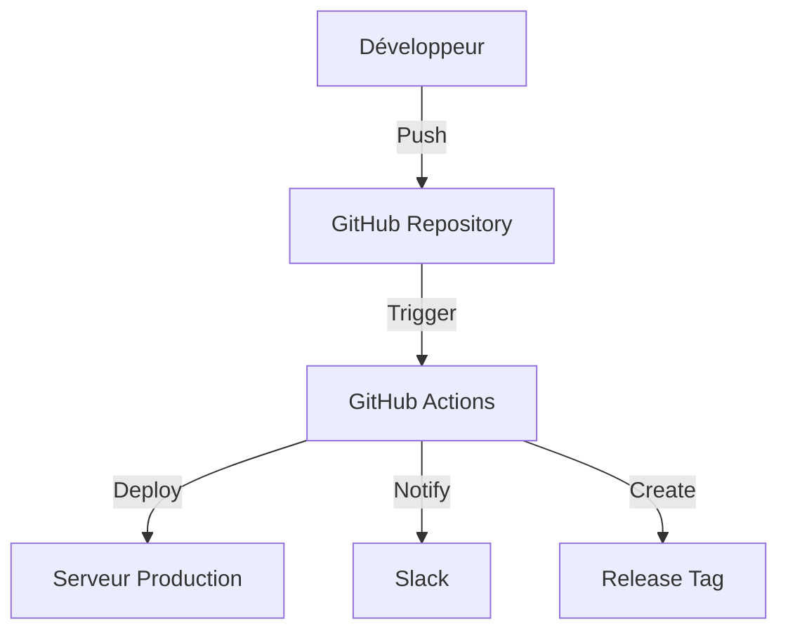

# DevOps : Concepts et Architecture

## Introduction
Le système DevOps de MaBoussole CRM est conçu pour automatiser et sécuriser le processus de déploiement tout en maintenant une communication efficace avec l'équipe via Slack.

## Architecture Globale

## Composants Clés

### 1. Pipeline CI/CD
- **GitHub Actions** : Orchestrateur principal
- **Workflows** : Configuration des processus automatisés
- **Environnements** : Production et Staging

### 2. Système de Notification
- **Slack Webhooks** : Intégration pour les notifications
- **Messages Structurés** : Format standardisé des notifications
- **États de Déploiement** : Succès, Échec, En cours

### 3. Sécurité
- **Secrets GitHub** : Stockage sécurisé des credentials
- **Permissions** : Gestion granulaire des accès
- **SSH** : Connexion sécurisée au serveur

## Flux de Travail

1. **Déclenchement**
   - Push sur main/develop
   - Déploiement manuel via workflow_dispatch

2. **Validation**
   - Vérification des permissions
   - Validation des secrets
   - Tests automatisés

3. **Déploiement**
   - Création de la version
   - Synchronisation des fichiers
   - Mise à jour des dépendances

4. **Communication**
   - Notification de début
   - Statut en temps réel
   - Rapport de fin

## Bonnes Pratiques

### Sécurité
- Rotation régulière des secrets
- Principe du moindre privilège
- Audit des accès

### Déploiement
- Versioning sémantique
- Déploiements atomiques
- Rollback possible

### Communication
- Messages clairs et concis
- Statuts explicites
- Traçabilité complète

## Métriques Clés

1. **Performance**
   - Temps de déploiement
   - Taux de succès
   - Temps de rollback

2. **Qualité**
   - Couverture des tests
   - Nombre de rollbacks
   - Issues post-déploiement

3. **Communication**
   - Délai de notification
   - Clarté des messages
   - Taux de faux positifs
