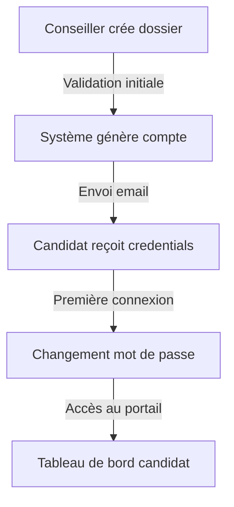

# Étude de Cas : Création de Compte Candidat

## Contexte du Problème

### Situation Initiale
L'application Ma Boussole nécessitait un système permettant aux candidats de suivre leur dossier d'admission aux universités internationales. Initialement, toute la gestion était faite par les conseillers, ce qui créait :
- Une charge de travail importante
- Des délais de traitement longs
- Un manque de transparence pour les candidats

### Objectifs
1. Autonomiser les candidats
2. Réduire la charge des conseillers
3. Améliorer la transparence
4. Accélérer le traitement des dossiers

## Analyse du Flux

### 1. Identification des Acteurs
```
- Conseiller : Crée le dossier initial
- Système : Gère la création du compte
- Candidat : Utilise le compte créé
```

### 2. Points Critiques
```
- Sécurité des données
- Facilité d'utilisation
- Fiabilité du processus
- Traçabilité des actions
```

## Solution Implémentée

### 1. Flux de Création de Compte


### 2. Code d'Implémentation

#### Création du Compte
```php
class DossierService
{
    public function créerCompteCandidat(Dossier $dossier)
    {
        // Générer les credentials
        $password = Str::random(12);
        
        // Créer le compte utilisateur
        $user = User::create([
            'name' => $dossier->prospect->full_name,
            'email' => $dossier->prospect->email,
            'password' => Hash::make($password)
        ]);
        
        // Assigner le rôle
        $user->assignRole('portail_candidat');
        
        // Envoyer l'email
        Mail::to($user->email)->send(new CompteCréé($user, $password));
        
        return $user;
    }
}
```

#### Notification par Email
```php
class CompteCréé extends Mailable
{
    public function build()
    {
        return $this->view('emails.compte-cree')
                    ->with([
                        'user' => $this->user,
                        'password' => $this->password,
                        'url' => route('portail.login')
                    ]);
    }
}
```

### 3. Tests Unitaires

```php
class CreationCompteTest extends TestCase
{
    public function test_creation_compte_candidat()
    {
        // Arrange
        $dossier = Dossier::factory()->create();
        
        // Act
        $service = new DossierService();
        $user = $service->créerCompteCandidat($dossier);
        
        // Assert
        $this->assertTrue($user->hasRole('portail_candidat'));
        $this->assertEquals($dossier->prospect->email, $user->email);
        
        // Vérifier l'envoi d'email
        Mail::assertSent(CompteCréé::class, function ($mail) use ($user) {
            return $mail->hasTo($user->email);
        });
    }
}
```

## Leçons Apprises

### 1. Aspects Techniques
- Importance de la gestion des erreurs
- Nécessité de logs détaillés
- Validation des données cruciale

### 2. Aspects Fonctionnels
- Communication claire avec le candidat
- Processus simple et intuitif
- Support utilisateur prévu

### 3. Bonnes Pratiques Identifiées
- Validation immédiate des données
- Notification en temps réel
- Documentation du processus

## Applications Possibles

### 1. Autres Contextes
- Création de compte client
- Système d'inscription
- Portail utilisateur

### 2. Améliorations Futures
- Authentification deux facteurs
- Personnalisation du profil
- Tableau de bord enrichi

### 3. Extensions Possibles
- Application mobile
- Intégration réseaux sociaux
- Chat support intégré

## Conclusion

Cette étude de cas démontre l'importance :
1. D'une analyse approfondie des besoins
2. D'une implémentation robuste
3. De tests rigoureux
4. D'une documentation claire

Le succès du projet repose sur :
- La simplicité du processus
- La fiabilité du système
- La satisfaction utilisateur
