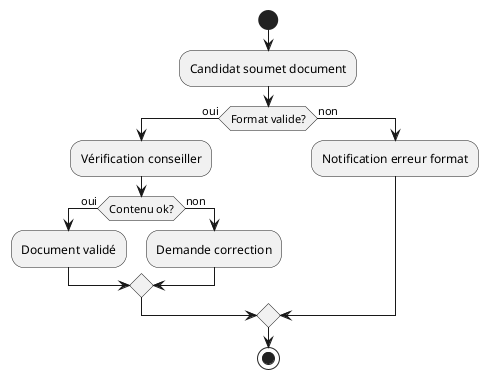

# Guide d'Utilisation des Flux Fonctionnels

## Utilisation Quotidienne

### 1. Analyse d'une Nouvelle Fonctionnalité

#### Étape 1 : Identifier les Acteurs
```
1. Qui sont les utilisateurs ?
   - Utilisateurs directs (ex: candidats, conseillers)
   - Systèmes externes (ex: système de notification)
   - Administrateurs

2. Quelles sont leurs attentes ?
   - Objectifs principaux
   - Contraintes spécifiques
   - Niveau d'expertise
```

#### Étape 2 : Décomposer le Processus
```
1. Point de départ
   - Événement déclencheur
   - Conditions préalables

2. Étapes intermédiaires
   - Actions requises
   - Points de décision
   - Validations nécessaires

3. Point d'arrivée
   - Résultat attendu
   - États possibles
```

### 2. Documentation des Flux

#### Template de Base
```markdown
# Nom du Flux
## Description
[Brève description du flux]

## Acteurs
- Acteur 1 : [rôle et responsabilités]
- Acteur 2 : [rôle et responsabilités]

## Étapes
1. [Nom de l'étape]
   - Action : [description]
   - Acteur : [qui]
   - Résultat : [quoi]

2. [Étape suivante...]

## Conditions
- Si [condition], alors [action]
- Sinon, [action alternative]
```

#### Exemple Concret : Validation Document
```markdown
# Flux de Validation de Document
## Description
Processus de validation d'un document soumis par un candidat

## Acteurs
- Candidat : soumet le document
- Système : vérifie le format
- Conseiller : valide le contenu

## Étapes
1. Soumission
   - Action : Upload du document
   - Acteur : Candidat
   - Résultat : Document en attente

2. Vérification Format
   - Action : Contrôle automatique
   - Acteur : Système
   - Résultat : Format validé/rejeté

3. Validation Contenu
   - Action : Examen du document
   - Acteur : Conseiller
   - Résultat : Document accepté/refusé
```

### 3. Outils du Quotidien

#### Draw.io (Recommandé)
1. Créer un nouveau diagramme
   ```
   File → New → Flowchart
   ```

2. Utiliser les formes standards
   ```
   - Rectangle : Actions
   - Diamant : Décisions
   - Flèches : Flux
   ```

3. Exporter/Partager
   ```
   File → Export As → PNG/SVG
   ```

#### PlantUML (Pour les Développeurs)


### 4. Cas d'Utilisation Pratiques

#### Exemple 1 : Création de Compte
```
[Conseiller] → Crée dossier
    ↓
[Système] → Génère compte
    ↓
[Système] → Envoie email
    ↓
[Candidat] → Active compte
    ↓
[Système] → Confirme activation
```

#### Exemple 2 : Suivi de Document
```
[Candidat] → Upload document
    ↓
[Système] → Vérifie format
    ↓
[Conseiller] → Examine contenu
    ↓
[Système] → Met à jour statut
    ↓
[Système] → Notifie candidat
```

### 5. Bonnes Pratiques Quotidiennes

#### Pour l'Analyse
1. **Toujours commencer par les questions de base**
   - Qui ? (acteurs)
   - Quoi ? (actions)
   - Quand ? (déclencheurs)
   - Comment ? (méthode)
   - Pourquoi ? (objectif)

2. **Valider avec les parties prenantes**
   - Présenter le flux
   - Recueillir les retours
   - Ajuster si nécessaire

#### Pour la Documentation
1. **Maintenir à jour**
   - Dès qu'un changement est fait
   - Noter les modifications
   - Versionner les documents

2. **Rester cohérent**
   - Utiliser les mêmes termes
   - Suivre le même format
   - Référencer les documents liés

### 6. Résolution de Problèmes Courants

#### Problème : Flux Trop Complexe
```
Solution :
1. Décomposer en sous-flux
2. Créer des modules réutilisables
3. Documenter les points clés
```

#### Problème : Manque de Clarté
```
Solution :
1. Utiliser des noms explicites
2. Ajouter des descriptions
3. Inclure des exemples
```

### 7. Checklist Quotidienne

#### Avant de Commencer
- [ ] Identifier tous les acteurs
- [ ] Définir les objectifs
- [ ] Lister les prérequis

#### Pendant l'Analyse
- [ ] Documenter chaque étape
- [ ] Valider les conditions
- [ ] Vérifier la cohérence

#### Après la Modélisation
- [ ] Revoir avec l'équipe
- [ ] Tester les scénarios
- [ ] Mettre à jour la doc

## Conclusion

Les flux fonctionnels sont des outils quotidiens qui :
- Clarifient les processus
- Facilitent la communication
- Améliorent la qualité
- Réduisent les erreurs

### Rappel Important
1. Commencer simple
2. Itérer régulièrement
3. Documenter clairement
4. Valider fréquemment
