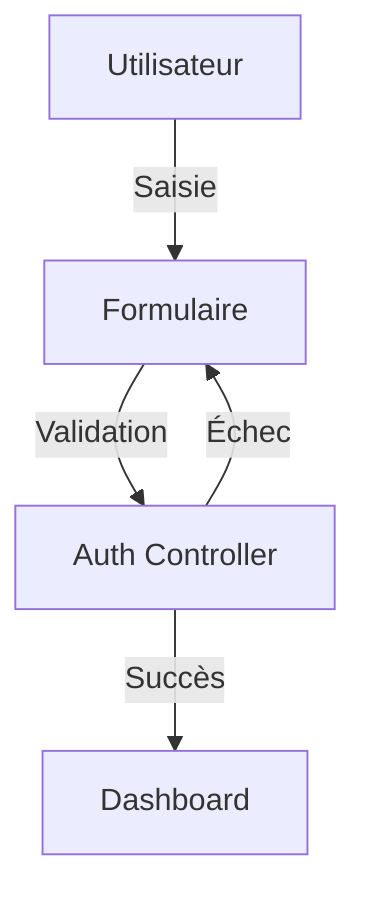

# Concepts de Design de la Page de Connexion

## Principes Fondamentaux

### 1. Expérience Utilisateur
- **Simplicité** : Interface épurée et intuitive
- **Clarté** : Messages et instructions clairs
- **Feedback** : Retours visuels immédiats sur les actions
- **Accessibilité** : Design adapté à tous les utilisateurs

### 2. Design Split-Screen

#### Objectifs
- Créer une expérience immersive
- Équilibrer fonctionnalité et esthétique
- Renforcer l'identité de marque
- Inspirer confiance aux utilisateurs

#### Structure
```
┌─────────────────┬─────────────────┐
│                 │                 │
│   Formulaire    │     Slider      │
│   de Connexion  │    d'Images     │
│                 │                 │
└─────────────────┴─────────────────┘
```

### 3. Identité Visuelle

#### Palette de Couleurs
- **Principal** : Violet Ma Boussole (#663399)
- **Dégradés** : Du violet clair au violet foncé
- **Accents** : Blanc pour le contraste
- **Transparences** : Pour la profondeur

#### Typographie
- Police principale : System UI
- Tailles de texte hiérarchiques
- Emphase sur la lisibilité

### 4. Animations et Transitions

#### Principes
- Subtiles et fluides
- Renforcement du feedback
- Non intrusives
- Performance optimisée

#### Types d'Animations
1. Transitions de slides
2. Fondus enchaînés
3. Animations de texte
4. Effets de zoom subtils

### 5. Responsive Design

#### Adaptations Mobile
- Masquage du slider
- Réorganisation du formulaire
- Ajustement des tailles
- Optimisation des interactions tactiles

### 6. Messages et Communication

#### Hiérarchie des Messages
1. Titre principal
2. Instructions de connexion
3. Messages d'erreur
4. Messages inspirants

#### Ton et Style
- Professionnel mais accessible
- Encourageant et positif
- Clair et concis
- Cohérent avec la marque

## Architecture Technique

### 1. Composants
- Page de connexion personnalisée
- Système de thèmes Filament
- Gestionnaire d'authentification
- Gestionnaire de médias

### 2. Interactions


### 3. Sécurité
- Protection CSRF
- Limitation des tentatives
- Validation des entrées
- Gestion des sessions

## Évolution Future

### Améliorations Potentielles
1. Authentification multi-facteurs
2. Personnalisation des messages par rôle
3. Animations plus complexes
4. Intégration de vidéos

### Maintenance
- Mise à jour régulière des dépendances
- Optimisation des performances
- Tests d'accessibilité
- Retours utilisateurs
