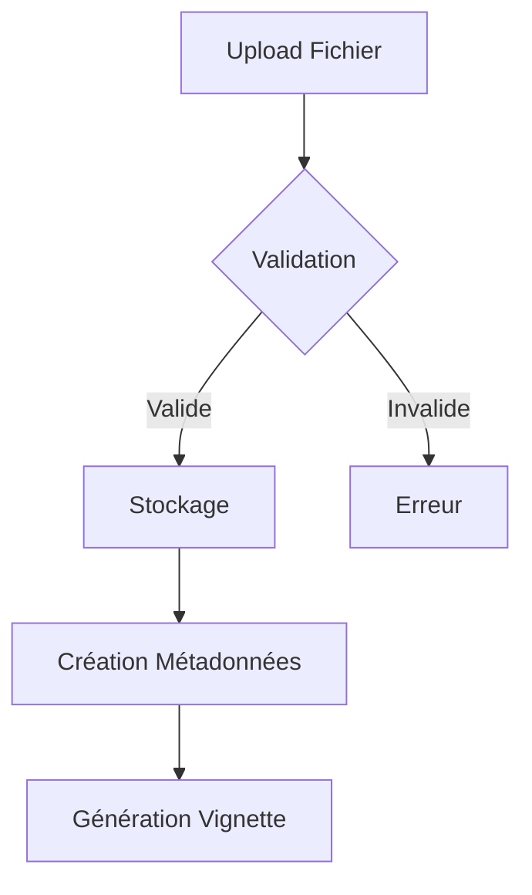
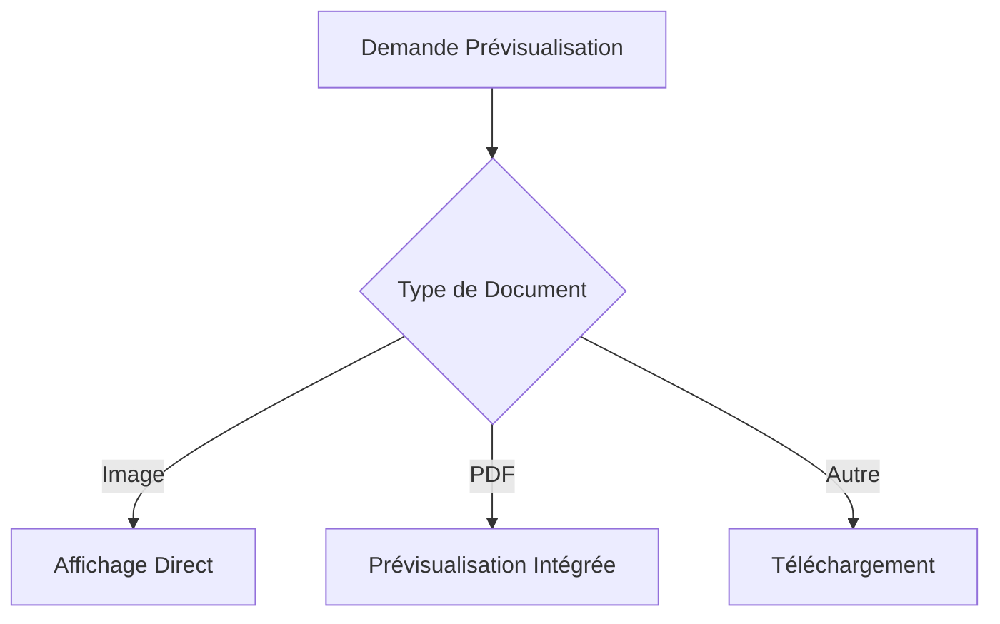

# Concepts Fondamentaux - Gestion des Documents

## Architecture du Système

### 1. Modèle de Données
```
DossierDocument
├── ID
├── Dossier ID (relation)
├── Type de document
├── Chemin du fichier
├── Nom original
├── Type MIME
├── Taille
└── Date d'upload
```

### 2. Système de Stockage
- Utilisation du système de stockage public de Laravel
- Structure de dossiers organisée par date
- Séparation des vignettes et des documents originaux

### 3. Système de Cache
- Cache des métadonnées
- Cache des vignettes
- Cache du contenu pour les petits fichiers

## Principes de Conception

### 1. Sécurité
- Validation stricte des types de fichiers
- Contrôle d'accès basé sur les rôles
- Protection contre les fichiers malveillants

### 2. Performance
- Génération et mise en cache des vignettes
- Optimisation des requêtes de fichiers
- Gestion efficace de la mémoire

### 3. Expérience Utilisateur
- Prévisualisation intuitive
- Retour immédiat sur les actions
- Interface responsive

## Flux de Données

### 1. Upload de Document


### 2. Prévisualisation de Document


## Gestion des Permissions

### 1. Hiérarchie des Rôles
```
Super Admin
└── Accès total
    
Manager
└── Documents des dossiers gérés
    
Client
└── Documents personnels
```

### 2. Points de Contrôle
- Validation à l'upload
- Vérification à la prévisualisation
- Contrôle au téléchargement

## Optimisation des Ressources

### 1. Stratégie de Cache
```
Cache Court Terme (1 heure)
└── Contenu des petits fichiers

Cache Moyen Terme (1 jour)
└── Types MIME
└── Métadonnées

Cache Long Terme (1 semaine)
└── Vignettes
```

### 2. Gestion de l'Espace
- Nettoyage automatique des vignettes non utilisées
- Compression des images
- Limitation de la taille des fichiers

## Extensibilité

### 1. Points d'Extension
- Support de nouveaux types de documents
- Intégration de services de prévisualisation
- Ajout de fonctionnalités de traitement

### 2. Interfaces Standard
```php
interface DocumentPreviewInterface
{
    public function isPreviewable(): bool;
    public function getPreviewUrl(): string;
    public function generateThumbnail(): ?string;
}
```

## Bonnes Pratiques

### 1. Validation des Fichiers
- Vérification du type MIME réel
- Validation de la taille
- Scan antivirus (recommandé)

### 2. Stockage
- Organisation par date
- Noms de fichiers uniques
- Sauvegarde régulière

### 3. Sécurité
- Validation des permissions
- Protection contre les injections
- Logs d'accès
