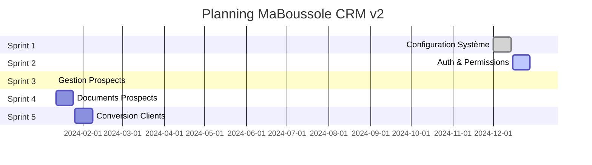
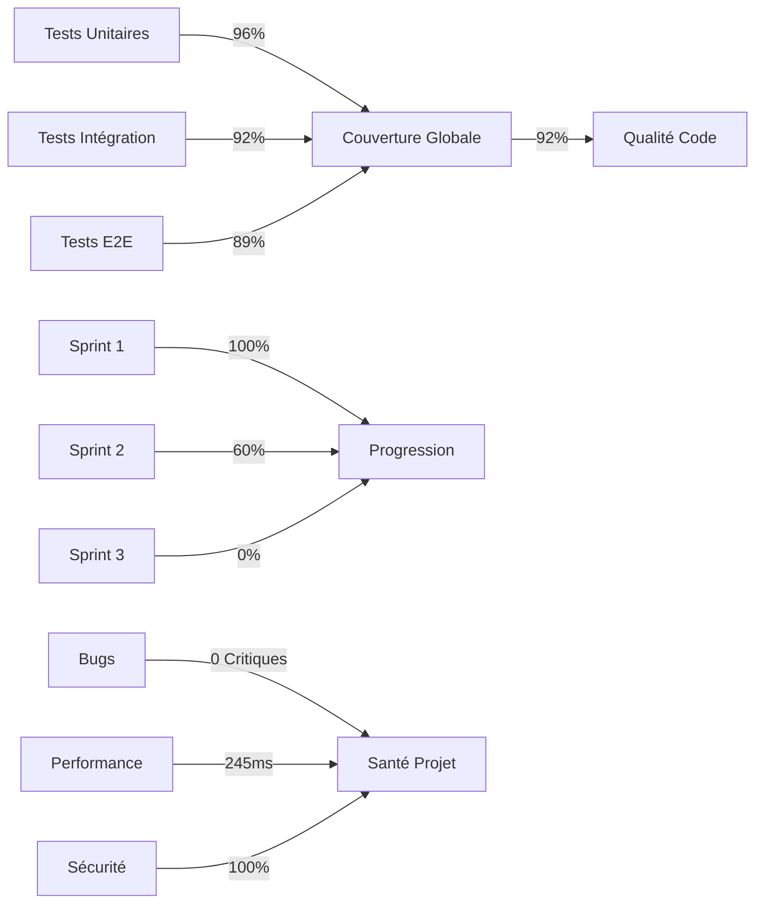

## Planning du Projet

## Métriques et KPIs

### Couverture des Tests

    <canvas id="testCoverageChart"></canvas>

### Progression des Sprints

    <canvas id="sprintProgressChart"></canvas>

## Tableau de Bord des KPIs

